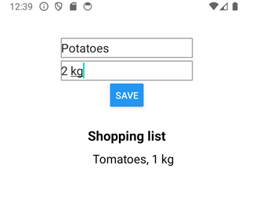
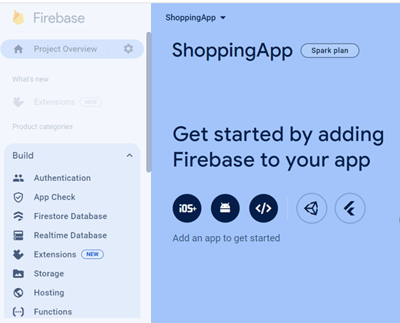
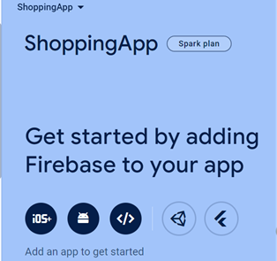
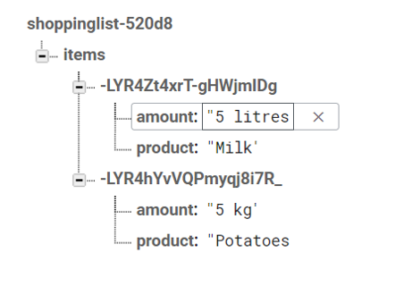

**Firebase** (https://firebase.google.com/) is a platform developed by Google that provides a variety of tools and services for building and managing mobile and web applications. 

Firebase provides **Realtime Database** that is NoSQL cloud database. Data is stored as JSON and synchronized in realtime to every connected client. 

To use the Firebase Realtime Database with React Native, you can use **Firebase JavaScript SDK** or **React Native Firebase**. In this material, we are using the JavaScript SDK (https://firebase.google.com/docs/database/web/start).
### Installation
You can install Firebase JavaScript SDK using the following command:
```bash
npx expo install firebase
```
See also step 3: **Configure Metro** in https://docs.expo.dev/guides/using-firebase/
### Shopping List
Next, we will implement a simple Shopping list app where users can enter products (title and amount) and save them to the Firebase Realtime Database. Products will be listed using the `FlatList` component. 



#### Create Expo project
Create a new Expo project and install Firebase JavaScript SDK.

```bash
npx create-expo-app shoppinglist
cd shoppinglist
npx expo install firebase
```

#### Create Firebase Project
To use Firebase, we have to create a project in Firebase.

1. Sign up to Firebase (https://firebase.google.com/).

2. Create a new Firebase project and create new realtime database (Build menu).

 

In the Security Rules, you can select **Start in test mode**. You can change security rules later in Realtime Database -> **Rules** tab.

3. Add new App to you Firebase project (**Web app**) 

 

Now, you can get the initialization code in the App registration phase. Copy the initialization code, we will need that later:

```js
// Import the functions you need from the SDKs you need
import { initializeApp } from 'firebase/app';

// Your web app's Firebase configuration
const firebaseConfig = {
  apiKey: "AIzjSyA8Bh7rwerN4OGbVLedJ54hjWj6FHP3fqpegwQ",
  authDomain: "shoppingapp-91ahe.firebaseapp.com",
  databaseURL: "https://shoppingapp-91-rtdb.us-west1.firebasedatabase.app",
  projectId: "shoppingapp-91ede",
  storageBucket: "shoppingapp-91ede.appspot.com",
  messagingSenderId: "1056464134052",
  appId: "1:10864638354052:web:e959565f804cacd0ed691"
};

// Initialize Firebase
const app = initializeApp(firebaseConfig);
```
Now, we are ready to start app development.

#### Initialize Firebase

Let's create a new file named **firebaseConfig.js** in our Expo project. Copy the initialization code from the previous step. If you haven't copied the code, you can get the initialization code from the Firebase: Project Overview -> Project Settings

Copy the code to the `firebaseConfig.js` file and export the `app`:

```js title="firebaseConfig.js
import { initializeApp } from "firebase/app";

const firebaseConfig = {
  apiKey: "AIzjSyA8Bh7rwerN4OGbVLedJ54hjWj6FHP3fqpegwQ",
  authDomain: "shoppingapp-91ahe.firebaseapp.com",
  databaseURL: "https://shoppingapp-91-rtdb.us-west1.firebasedatabase.app",
  projectId: "shoppingapp-91ede",
  storageBucket: "shoppingapp-91ede.appspot.com",
  messagingSenderId: "1056464134052",
  appId: "1:10864638354052:web:e959565f804cacd0ed691"
};

// Add export keyword here
export const app = initializeApp(firebaseConfig);
```

The `firebaseConfig` object contains the configuration settings required to initialize Firebase within the app. The `initializeApp` function is called with the `firebaseConfig` object as its parameter. This initializes Firebase within the application using the provided configuration. Finally, the initialized Firebase `app` instance is exported using `export const app`. This allows other parts of the application to import and use the initialized Firebase app for accessing Firebase services

#### Shopping App
Now, we are ready to start develope the shopping list app. We create two states for product and list items that we can show all shopping items in the `FlatList` component. Open the `App.js` file and create the following states:
```js title="App.js"
const [product, setProduct] = useState({
  title: '',
  amount: ''
});
const [items, setItems] = useState([]);
```
Next, we add two `TextInput` components that are used to store entered values in the `product` state's `title` and `amount` properties. We also add the `Button` component that execute `handleSave` function when the button is pressed.

```jsx title="App.js"
const handleSave = () => {
}

return (  
  <View style={styles.container}>
    <TextInput 
      placeholder='Product title' 
      onChangeText={text => setProduct({...product, title: text})}
      value={product.title}/>  
    <TextInput 
      placeholder='Amount' 
      onChangeText={text => setProduct({...product, amount: text})}
      value={product.amount}/>   
    <Button onPress={handleSave} title="Save" /> 
  </View>
);
```
Next, we implement the save functionality. Import the `app` instance from the `firebaseConfig`.
```js title="App.js"
import { app } from './firebaseConfig';
```
To use realtime database, we have to intialize realtime database and get a reference to service using the `getDatabase` method. Add the following import and call the `getDatabase` method:
```js title ="App.js"
import { getDatabase } from "firebase/database";

const database = getDatabase(app);
```
No, we are ready to use realtime database. The Database reference is needed to perform database operations. The `ref` method creates a reference to a location in the Firebase realtime database. Data can be saved using the `push` method. We have to add the following imports in our `App` component. 
```js title ="App.js"
import { getDatabase, ref, push } from "firebase/database";
```
 Then we call the `push` method in our `handleSave` function. The first argument is a reference to location where data is saved. The second argument is data that is saved (`product` object). The `push` method automatically generates unique id for items in the Firebase realtime database.

```js
const handleSave = () => {
  push(ref(database, 'items/'), product); 
}
```
Let's also add check that empty products are not saved:
```js
const handleSave = () => {
  if (product.amount && product.title) {
    push(ref(database, 'items/'), product);
  }
  else {
    Alert.alert('Error', 'Type product and amount first');
  }
}
```
Now, if you save products, you should see these in your Firebase Realtime Database:



Data can be read by using `onValue` that listens for data changes in the Firebase realtime database. In our case, it listens for changes to the data at the specified reference (`itemsRef`). Whenever the data changes, the callback function provided (`(snapshot) => { ... }`) will be executed. 

Inside the callback function, `snapshot.val()` retrieves the current value of the data at the specified reference. This data is a JavaScript object where the keys are the unique IDs of the items and the values are the shopping item objects. Then, we convert values of the fetched data into an array using `Object.values(data)` and store that to the `items` state.
```js title="App.js"
// Import onValue & useEffect
import { useState, useEffect } from 'react';
import { getDatabase, push, ref, onValue } from 'firebase/database';

// Execute onValue inside the useEffect
useEffect(() => {
  const itemsRef = ref(database, 'items/');
  onValue(itemsRef, (snapshot) => {
    const data = snapshot.val();
    if (data) {
      setItems(Object.values(data));
    } else {
      setItems([]); // Handle the case when there are no items
    }
  })
}, []);
```
Finally, we add `FlatList` component and display products that are saved to the `items` state.
```jsx title="App.js"
<FlatList 
  renderItem={({item}) => 
    <View style={styles.listcontainer}>
      <Text style={{fontSize: 18}}>{item.title}, {item.amount}</Text>
    </View>} 
  data={items} />      
```

### Read More
- Firebase Realtime Database documentation: https://firebase.google.com/docs/database
- Firebase Authentication: https://firebase.google.com/docs/auth
- Supabase (Open source alternative to Firebase); https://supabase.com/ 
