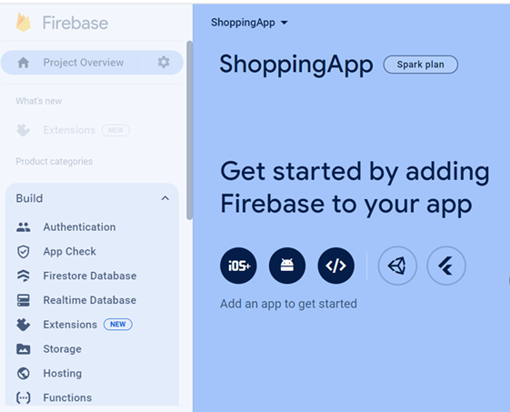

**Firebase** (https://firebase.google.com/) is a platform developed by Google that provides a variety of tools and services for building and managing mobile and web applications. 

Firebase provides **Realtime Database** that is NoSQL cloud database. Data is stored as JSON and synchronized in realtime to every connected client. 

To use the Firebase Realtime Database with React Native, you can use **Firebase JavaScript SDK** or **React Native Firebase**. In this material, we are using the JavaScript SDK.
### Installation
You can install Firebase JavaScript SDK using the following command:
```bash
npx expo install firebase
```
See also step 3: **Configure Metro** in https://docs.expo.dev/guides/using-firebase/
### Shopping List
Next, we will implement a simple Shopping list app where users can enter products (title and amount) and save them to the Firebase Realtime Database. Products will be listed using the `FlatList` component. 

Create a new Expo project and install Firebase JavaScript SDK.

#### Create Firebase Project
To use Firebase, we have to create a project in Firebase.
- Sign up to Firebase (https://firebase.google.com/).
- Create a new Firebase project and create new realtime database (Build menu).
- Add new App to you Firebase project (Web app). 

 

- In the Realtime database, define your database rules for demo purposes: Database --> Rules tab
```json
 "rules": {
   ".read": true,
   ".write": true
 }
```
#### Imports
- First, the following imports are needed:

```js
import { initializeApp } from 'firebase/app';
import { getDatabase, push, ref, onValue } from 'firebase/database';
```
### Initalize Firebase
- Get your app intialization codes: Project Overview --> Project Settings
- Initialize Firebase app and realtime database connection in your React Native app and create reference to the realtime database:

```js
// Initialize Firebase with your own config parameters
const firebaseConfig = {
  apiKey: "AIzaSyDj8VKxFj9kYKng0Gfy12345",
  authDomain: "shoppinglist.firebaseapp.com",
  databaseURL: "https://shoppinglist.firebaseio.com",
  projectId: "shoppinglist",
  storageBucket: "shoppinglist.appspot.com",
  messagingSenderId: "54449XX3822XX"
};

const app = initializeApp(firebaseConfig);
const database = getDatabase(app);
```
- Database reference is needed to perform database operations.
- The `ref` function creates a reference to a location in the Firebase realtime database. In the following code, it's referencing the ***items/*** location. This means you want to interact with the ***items*** node in your database.
```js
ref(database,'items/')
```
- Declare states for product and list items that you can show all shopping items in the `FlatList` component.
```js
const [product, setProduct] = useState({
  title: '',
  amount: ''
});
const [items, setItems] = useState([]);
```
- Add two `TextInput` components that are used to store entered values in the `product` state's `title` and `amount` properties.
- Add `Button` component that executes `saveItem` function when the button is pressed.
- Data can be saved using the `push` method. The first argument is a reference to location where data is saved. The second argument is data that is saved (`product` object).
- The `push` method automatically generates unique id for items in the Firebase realtime database.

```js
const saveItem = () => {
  push(ref(database, 'items/'), product); 
}
```


- Data can be read by using `onValue` that listens for data changes in the Firebase realtime database.That triggers a callback each time the data changes and we get a current snapshot of our collection (in this case `items`)

```js
useEffect(() => {
  const itemsRef = ref(database, 'items/');
  onValue(itemsRef, (snapshot) => {
    const data = snapshot.val();
    setItems(Object.values(data));
  })
}, []);

```
- Finally, you can add `FlatList` component and render `items` state data.

### Read More
- Firebase Realtime Database documentation: https://firebase.google.com/docs/database
- Firebase Authentication: https://firebase.google.com/docs/auth
- Supabase (Open source alternative to Firebase); https://supabase.com/ 
