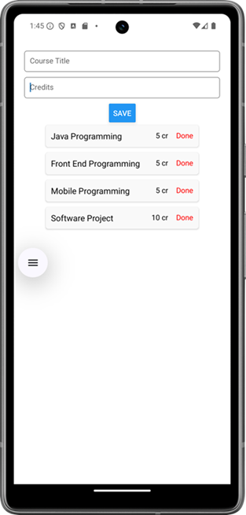

**SQLite**  (https://www.sqlite.org/) is light-weight SQL database and it is built into both Android and iOS devices.`expo-sqlite` is the library that gives an access to SQLite database.

Installation:
```bash
npx expo install expo-sqlite 
```
Example: Courselist app where user types course title and credits. The course is saved to a database when save button is pressed. All courses are shown in the flatlist component.



First, import the SQLite from `expo-sqlite` to your Component
```js
import * as SQLite from 'expo-sqlite';
```
States are needed for title and credit input fields and all courses that are shown in the `FlatList`.

```js
 const [credit, setCredit] = useState('');
 const [title, setTitle] = useState('');
 const [courses, setCourses] = useState([]);
```
Next, we intialize the database connection using the `openDatabase` function.  The function takes a single argument, which is the name of the SQLite database file to open or create. If the specified database file exists, it will be opened. If it doesn't exist, a new database file with that name will be created.

```js
const db = SQLite.openDatabase('coursedb.db');
```

Opening a database returns database object.  The object has method `transaction` which can be used for database operations. Method has three parameters: The first is one is used to execute sql statement. The second one is an optional error callback function that is called if an error occurs during the transaction. The third one is executed when transaction is completed successfully.

```js
db.transaction(callback, error, success)
```
Database is created in the `useEffect` hook by using transaction's `executeSql` method.

```js
  useEffect(() => {
    db.transaction(tx => {
      tx.executeSql('create table if not exists course (id integer primary key not null, credits int, title text);');
    }, () => console.error("Error when creating DB"), updateList);  
  }, []);
```
The `updateList` function fetch all courses from the database and updates the `FlatList` (code is shown later).

In the `return` statement we rended two input fields (title and credits) and button which saves item to database when it is pressed. The button will execute `saveItem` function which handles `insert` operation to database.

```jsx
<TextInput 
  placeholder='Title' 
  onChangeText={title => setTitle(title)}
  value={title}/> 
<TextInput 
  placeholder='Credits' 
  keyboardType='numeric' 
  onChangeText={credit => setCredit(credit)}
  value={credit}/> 
<Button onPress={saveItem} title="Save" />
```
The `saveItem` function uses `executeSql` method to insert new item in the course table. The `updateList` function is executed after successful insert. Query argument array is the second parameter in executeSql method (substitutes ?-marks in the SQL statement)

```js
const saveItem = () => {
  db.transaction(tx => {
    tx.executeSql('insert into course (credits, title) values (?, ?);',
	  [parseInt(credit), title]);
    }, null, updateList)
}
```
The `updateList` function fetch all items from the course table and save data to `courses` state (-> re-render).  The third parameter of the `executeSql` function is success function which takes resultset object as a second argument. The Resultset object contains `rows._array` which is the array of rows returned by query.

```js
const updateList = () => {
  db.transaction(tx => {
    tx.executeSql('select * from course;', [], (_, { rows }) =>
      setCourses(rows._array)
    ); 
  }, null, null);
}
```
In the `FlatList` component, we show title and credits of the courses. Each rows contains also `Text` component that executes `deleteItem` function when it is pressed. The unique id of the item is passed to the delete function.

```jsx
<FlatList 
  style={{marginLeft : "5%"}}
  keyExtractor={item => item.id.toString()} 
  renderItem={({item}) => 
    <View style={styles.listcontainer}>
      <Text>{item.title},{item.credits} </Text>
      <Text style={{color: '#0000ff'}} onPress={() => deleteItem(item.id)}>done</Text>
    </View>}     	
  data={courses} 
/> 
```
The `deleteItem` function deletes item from the course table and updates flatlist after the deletion.

```js
const deleteItem = (id) => {
  db.transaction(
  tx => tx.executeSql('delete from course where id = ?;', [id]);}, null, updateList) 
}
```

