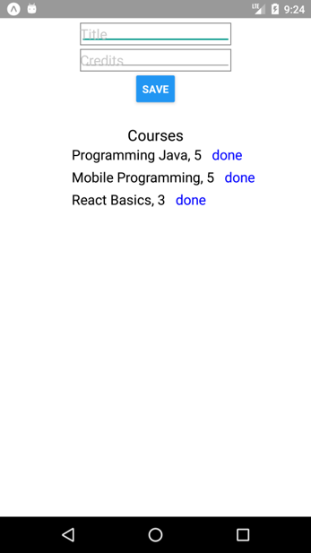
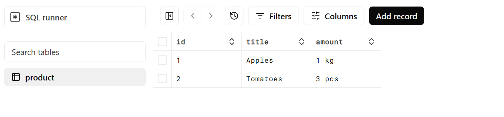

**SQLite**  (https://www.sqlite.org/) is light-weight SQL database and it is built into both Android and iOS devices.`expo-sqlite` is the library that gives an access to SQLite database on the device.

Installation:
```bash
npx expo install expo-sqlite 
```
Example: Course list app where user types course title and credits. The course is saved to a database when save button is pressed. All courses are displayed in the flatlist component.



First, import the SQLite from `expo-sqlite` to your Component
```js
import * as SQLite from 'expo-sqlite';
```
Define a TypeScript type that matches the database schema:
```ts
type Course = {
  id: number;
  title: string;
  credits: number;
};
```
States are needed for title and credit input fields and all courses that are shown in the `FlatList`.
```ts
const [credit, setCredit] = useState('');
const [title, setTitle] = useState('');
const [courses, setCourses] = useState<Course[]>([]);
```
Next, we intialize the database connection using the `openDatabaseSync` function.  The function takes a single argument, which is the name of the SQLite database file to open or create. If the specified database file exists, it will be opened. If it doesn't exist, a new database file with that name will be created.

```ts
const db = SQLite.openDatabaseSync('coursedb');
```
:::note
  The library has synchronous and asynchronous versions of functions. Running heavy tasks with synchronous functions can block the JavaScript thread and affect performance.

  We will be using mostly asynchronous functions in this example. For simplicity, we make here a synchronous call to open the database.
:::
Opening the database returns database object. Using the methods of the database object we can execute SQL queries. 

First we need create the database schema in case this is the first invocation of the application. We write a function to create the schema and use the `execAsync` method to execute the SQL query.

```ts
const initialize = async () => {
  try {
    await db.execAsync(`
      CREATE TABLE IF NOT EXISTS course (id INTEGER PRIMARY KEY NOT NULL, credits INT, title TEXT);
    `);
    // Todo: update the course list
  } catch (error) {
    console.error('Could not open database', error);
  }
}
```
:::note
Because we use the `async`-`await`syntax to handle the asynhronous calls we need to use `try`-`catch` `exception handling to handle possible database errors. 
:::

The application logic would require that we retrieve the course list from the database and render it for the user at startup. The function to do that will be implemented later. 

We make only one query but multiple queries could be done in one `execAsync` call. For that reason we need to terminate the query with a semicolon (`;`).

The database initialization function is called using the `useEffect` hook. 

```ts
useEffect(() => { initialize() }, []);
```
Next we need a way to create content in the database. We add two input fields (title and credits) and a button to save the new item to the database when pressed. The button will call function `saveItem`.

```tsx
<TextInput 
  placeholder='Title' 
  onChangeText={title => setTitle(title)}
  value={title}/> 
<TextInput 
  placeholder='Credits' 
  keyboardType='numeric' 
  onChangeText={credit => setCredit(credit)}
  value={credit}/> 
<Button onPress={handleSave} title="Save" />
```
We write function `handleSave` to make the `INSERT` query to add rows into the database. We use `runAsync` method to execute the query. 
```ts
const handleSave = async () => {
  try {
    await db.runAsync('INSERT INTO course (title, credits) VALUES (?, ?)', title, credit);
    // Todo: update the course list
  } catch (error) {
    console.error('Could not add item', error);
  }
};
```
The `?` placeholders keep user input separate from the SQL syntax, preventing SQL injection attacks and ensuring values are treated as data, not executable SQL.

You can also use tagged template literals: https://docs.expo.dev/versions/latest/sdk/sqlite/#tagged-template-literals-api:

```ts
const handleSave = async () => {
  try {
    await db.sql`INSERT INTO course (title, credits) VALUES (${title}, ${credit})`;
    // Todo: update the course list
  } catch (error) {
    console.error('Could not add item', error);
  }
};
```
the template literal is passed directly as a tag. The values inside `${}` are still treated as safe bind parameters, so SQL injection protection is maintained.

Finally we can implement the function `handleFetch` to get the list of courses from the database. The function makes a `SELECT` query using method `getAllAsync` to fetch all rows from the course table and updates the data to state variable `courses`. The state update launches a re-render.
```ts
const handleFetch = async () => {
  try {
    const list = await db.getAllAsync('SELECT * from course');
    setCourses(list as Course[]);
  } catch (error) {
    console.error('Could not get items', error);
  }
}
```
The `handleFetch` function should be executed at first render and after any successful change in the database. Add the `updateList` call to the placeholders in the functions defined earlier.

In the `FlatList` component, we show the title and credits of the courses. For deleting courses we add a `Text` component on each row and attach an `onPress` action to that calls function `handleDelete` to each component. The unique id of the item is passed to the delete function.

```tsx
<FlatList
  keyExtractor={item => item.id.toString()}
  renderItem={({ item }) =>
    <View style={{ flexDirection: 'row'}}>
      <Text>{item.title}</Text>
      <Text>{item.credits} </Text>
      <Text style={{ color: '#ff0000' }} onPress={() => handleDelete(item.id)}>Delete</Text>
    </View>
  }
  data={courses}
/>
```
The `handleDelete` function deletes item from the course table and updates the course list after the deletion.
```ts
const handleDelete = async (id: number) => {
  try {
    await db.runAsync('DELETE FROM course WHERE id=?', id);
    await handleFetch();
  }
  catch (error) {
    console.error('Could not delete item', error);
  }
}
```
### Using `SQLiteProvider` component

If there are sevaral components in the application, `SQLiteProvider` component can be used to share the database across the components. All components rendered within a `SQLiteProvider` can access the database using the `useSQLiteContext` hook.

Let us refactor the application into two components: `App` provides the database context to all component within the app and `Courselist` renders the course list application.

```js title="App.tsx"
import { SQLiteProvider, SQLiteDatabase } from 'expo-sqlite';
import Courselist from './Courselist';

export default function App() {

  const initialize = async (db: SQLiteDatabase) => {
    db.execAsync(`
      CREATE TABLE IF NOT EXISTS course (id INTEGER PRIMARY KEY NOT NULL, credits INT, title TEXT);
    `);
  };

  return (
    <SQLiteProvider
      databaseName='coursedb.db'
      onInit={initialize}
      onError={error => console.error('Could not open database', error)}
    >
      <Courselist />
    </SQLiteProvider>
  );
}
```
`SQLIteProvider` properties:
- `databaseName` defines the database file name. `SQLiteProvider` takes care of opening the database. 
- `onInit ` defines an initialization handler that is run before rendering the children of the component. We use it to create the database schema.
- `onError` handler is called if an error occurs.

The `Courselist` component gets the database object by calling the `useSQLiteContext` hook. 

```ts title="Courselist.tsx"
// highlight-next-line
import { useSQLiteContext } from 'expo-sqlite';
// ...

export default function Courselist() {
  const [credit, setCredit] = useState('');
  const [title, setTitle] = useState('');
  const [courses, setCourses] = useState<Course[]>([]);

  // highlight-next-line
  const db = useSQLiteContext();

  const handleSave = async () => {
    try {
      await db.runAsync('INSERT INTO course VALUES (?, ?, ?)', null, credit, title);
      await handleFetch();
    } catch (error) {
      console.error('Could not add item', error);
    }
  };

  // ...

  // highlight-next-line
  useEffect(() => { handleFetch() }, []);
  // ...
```
Because the database initialization is done in an other component, we need to launch the initial list update using the `useEffect` hook.

You can also use Drizzle ORM (https://orm.drizzle.team/) or Knex.js query builder (https://knexjs.org/) with Expo SQLite. Read more about 3rd party library integrations in https://docs.expo.dev/versions/latest/sdk/sqlite/#third-party-library-integrations.

The database can be encrypted using SQL Chipher extension (https://www.zetetic.net/sqlcipher/).

### Debugging SQLite database

You can browse on-device SQLite database using Drizzle Studio (https://orm.drizzle.team/drizzle-studio/overview). 

To get started, install Expo Drizzle Studio plugin:

```bash
npm install expo-drizzle-studio-plugin
```
Then, setup Drizzle Studio plugin:

```tsx
import { useDrizzleStudio } from "expo-drizzle-studio-plugin";
import * as SQLite from "expo-sqlite";
import { View } from "react-native";

const db = SQLite.openDatabaseSync("db");

export default function App() {
    useDrizzleStudio(db);

    return <View></View>;
}
```
Run your app on physical device or emulator. Open the devtools menu from the terminal:
```
shift + m
```
Select `expo-drizzle-studio-plugin`.

Drizzle Studio opens in a browser and you can browse your database. You can also add new records to your database.

