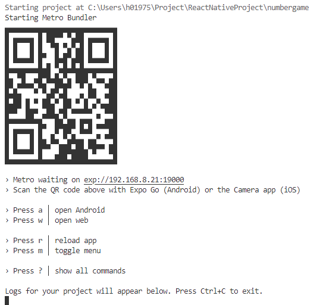

- During development time we run the packager and development server locally on the workstation.
- The Expo Go client loads the app from the local development server 
- Many clients can load the app from the development server but if we close the development server, the apps stop
- This makes sharing the app to others problematic

### Deploying apps to other users
- Running apps using the Expo Go client is feasible for development and testing purposes
- In order to be able to share the app to other users we need to create a standalone application
- The standalone binary app can be distributed in the app distribution channels, i.e. Apple App Store and/or Google Play Store. It can also be deployed to emulators or test devices directly  
- We will cover both publishing options here. They are both useful but for different purposes.

### Building standalone apps for Android and iOS
- In order to be able to deploy standalone apps we need to create different native builds for the different platforms
- This can be done using **Expo Application Services (EAS)** tools (https://expo.dev/eas):
```bash
npm install -g eas-cli    # install EAS tools globally
eas login                 # you need to have an Expo account to use EAS
eas build:configure       # create EAS configuration for your project
```
- Now you can make different builds for different purposes (development, preview, production) and platforms (Android, iOS). 
- The build will be done as a Continuous Integration (CI) build on Expo servers: the entire project is uploaded to the cloud, then downloaded by a build server, the dependencies are installed, and the build is run.

<p> https://docs.expo.dev/build/setup/ </p>

### Building for internal distribution on Android
- For Android you can build an apk-binary that can be installed on an emulator or a device directly.
- You may need to modify the build profile definition in `eas.json`
```json
{
  "build": {
    "preview": {
      "android": {
        "buildType": "apk"
      }
    },
```
- Run build
```bash
eas build -p android --profile preview
```
- When the build is complete, download and install the binary on an emulator or a device.

https://docs.expo.dev/build-reference/apk/

### Building for internal distribution on iOS
- For iOS you can build a iOS simulator build 
- You may need to modify the build profile definition in `eas.json`
```json
{
  "build": {
    "preview": {
      "ios": {
        "simulator": true
      }
    },
```
- Run build
```bash
eas build -p ios --profile preview
```
- When the build is complete, download and install the binary on an emulator or a device.

https://docs.expo.dev/build-reference/simulators/

### Deploying to App Stores
- To make the app publicly available it needs to be built and submitted to the app store of each platform
- Each platform has different requirements for publishing. There are also approval phases that the app needs to pass before it is made avaible in the app store
- Publishing to app stores is not free
    - Google has a one time $25 registration fee which you need to pay before you can upload an app.
    - Distribution via the Apple app store goes for an annual fee of USD$99

### Further information about publishing to app stores
EAS:
- Submitting to Google Play Store: https://docs.expo.dev/submit/android/
- Submitting to Apple App Store: https://docs.expo.dev/submit/ios/

Android: 
- https://developer.android.com/studio/publish
- https://www.androidauthority.com/publishing-first-app-play-store-need-know-383572 

iOS: 
- https://developer.apple.com/distribute/
- https://developer.apple.com/ios/submit/


### Some issues to consider when publishing
- Make sure that your app layout works in different screen form factors
    - small and large display sizes, handsets and tablets
- App icon
    - Expo tools can create the required different size icons, just provide an png icon file of adequate size and configure it in app.json
    - Platforms have different icon guidelines. You can provide a different icon file for each platform in app.json.
- Splash screen
    - Splash screen is the first screen that a user sees when opening your app. It stays visible while the app is loading.
    - You can define the splash screen image in app.json.
    - You can control the behavior of the splash screen with the AppLoading component in the App.

App stores best practices: https://docs.expo.dev/distribution/app-stores/

### Read more
- Expo Go: https://docs.expo.dev/workflow/expo-go/
- Distributing your app: https://docs.expo.dev/distribution/introduction/
- Configuring the app (app.json): https://docs.expo.dev/versions/latest/config/app/
- Splash screen and app icon: https://docs.expo.dev/tutorial/configuration/

