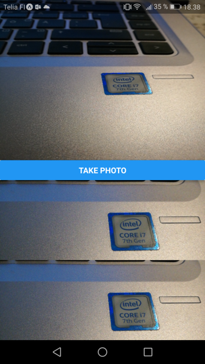

`CameraView` is the component that renders a preview of the device’s camera.

Installation:
```bash
npx expo install expo-camera
```
#### Example
In this example, users can take a photo which is then displayed in the app. The example app shows the viewfinder and taken picture in two different representations: base64 and local uri.



Import `Camera` and `useCameraPermissions` from `expo-camera` to your component. The `useCameraPermissions` is hook function to check or request permissions to access the camera.
```js
import { Camera, useCameraPermissions } from 'expo-camera/next';
```
We use states to store photo data. We also have to create a `ref` to camera component using `useRef` hook. By using `ref` we can get access to camera component's methods.

We check the permission to access camera by using the `useCameraPermissions` hook and the `permission` state value is `granted` if user has granted the permission.

```js
const [photoName, setPhotoName] = useState('');
const [photoBase64, setPhotoBase64] = useState('');
const [permission, requestPermission] = useCameraPermissions();

const camera = useRef(null);
```
In the `return` statement, we use conditional rendering. If the app has no permission to use camera we show a text 'No access to camera'.  Otherwise camera, photo previews and button are rendered.

```jsx
return (
  <View style={styles.container}>
    {permission === 'granted' ? (
        <View style={{ flex: 1 }}>
          <CameraView style={{ flex: 1, minWidth: "100%" }} ref={camera} />
          <Button title="Take Photo" onPress={snap} />
          <View style={{ flex: 1 }}>
            <Image style={{ flex: 1 }} source={{ uri: photoName }} />
            <Image style={{ flex: 1 }} source={{ uri: `data:image/jpg;base64,${photoBase64}` }} />
          </View>
        </View>
      ) : (
        <Text>No access to camera</Text>
      )}
  </View>
);
```
The `Button` component invokes a function called `snap` that takes a photo.
```js
<Button title="Take Photo" onPress={snap} />
```
Below is the source code of the `snap` function. Camera’s `takePictureAsync` method returns an object with properties: `uri`, `base64`, `width`, `height` and `exif`. The `base64` is string that contains JPEG data of the image (base64 encoded).

```js
const snap = async () => {
  if (camera) {
    const photo = await camera.current.takePictureAsync({base64: true});
    setPhotoName(photo.uri);
    setPhotoBase64(photo.base64); 
  }
};
```
:::note
The local image URI is temporary. You can use EXPO `FileSystem.copyAsync` to make a permanent copy of the image.
:::
