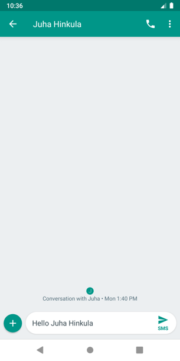

### EXPO Contacts
EXPO Contacts (https://docs.expo.dev/versions/latest/sdk/contacts/) can be used to get access your device’s contacts. First, you have to install `expo-contacts` using the following command in your app directory.
```bash
npx expo install expo-contacts 
```
In the following example, we create an app that fetch phone number from the contacts and send sms message to this number.

First, we have to import the `expo-contacts`:
```ts
import * as Contacts from 'expo-contacts';
```
Next, we check permission to be able to access the device’s contacts. The  `requestPermissionsAsync()` function is called to request permission to access the contacts on the user's device. It returns a promise that resolves to a `PermissionResponse` object. We destruct the resolved object to extract the `status` property.
```ts
const { status } = await Contacts.requestPermissionsAsync();
```
The value of `status` is `granted` if user has granted the permission. 
```ts
if (status === 'granted') {
  // Access contacts 
}
```
The `getContactsAsync(query)` method is used to get contacts from your device and it is asynchronous. The `query` is an optional object that can contain properties to filter and sort the contacts. The `getContactsAsync` method returns a promise that resolves to a `ContactResponse` object. The object contains `data` property that is an array of contacts that match a given query.
```ts
const getContacts = async () => {
  const { status } = await Contacts.requestPermissionsAsync();
  if (status === 'granted') {
    const { data } = await Contacts.getContactsAsync(
      { fields: [Contacts.Fields.PhoneNumbers] }
    );
   }
}
```
In the `query`, we specify that we want to retrieve phone numbers. You can also use `Contacts.Fields.Emails` to fetch email addresses. We then check whether any contacts are available and store the first contact object in a state.

To store the contact, we create a state. The `expo-contacts` library provides a `Contact` type that describes the shape of a contact object:
```ts
// import Contact type
import type { Contact } from 'expo-contacts';

// Create state to store contact
const [contact, setContact] = useState<Contact>({});
```
Store the first contact to `contact` state:
```ts
const getContacts = async () => {
  const { status } = await Contacts.requestPermissionsAsync();
  if (status === 'granted') {
    const { data } = await Contacts.getContactsAsync(
      { fields: [Contacts.Fields.PhoneNumbers] }
    );

    if (data.length > 0) {
      setContact(data[0]);
    }
    else {
      Alert.alert("Warning", "No contacts found.");      
    }
  }
}

```
Contact object looks the following (Android)
```ts
Object {
  "contactType": "person",
  "firstName": "Lisa",
  "id": "1",
  "imageAvailable": false,
  "lastName": "Smith",
  "lookupKey": "0r1-3B5137293739433D513F29",
  "name": "Lisa Smith",
  "phoneNumbers": Array [
    Object {
      "id": "1",
      "isPrimary": 0,
      "label": "mobile",
      "number": "1 234-566-985",
      "type": "2",
    },
  ],
}
```
In the `return` statement, we add the `Button` and `Text` components. The button execute the `getContacts` function and the name of the first contact is displayed in the `Text` component.

```tsx
return (
  <View style={styles.container}>
    <Text>{contact.name}</Text>
    <Button title="Get Contact" onPress={getContacts} />
  </View>
);
```
Now, You should see the first contact’s name when you press the button.


### EXPO SMS
EXPO SMS (https://docs.expo.dev/versions/latest/sdk/sms/) can be used to get access to device’s SMS messages. You can install it by typing the following command in your app directory.
```bash
npx expo install expo-sms 
```
After installing the package, import `expo-sms` into `App.tsx`:
```ts
import * as SMS from 'expo-sms';
```
Next, we will implement function to send SMS message to the contact.
The `isAvailableAsync()` method can be used to check if SMS is available in a device.

```ts
const sendSms = async () => {
  const isSMSAvailable = await SMS.isAvailableAsync();
  
  if (isSMSAvailable) {
    // Send a message
  }
}
```
The SMS message can be sent using the `sendSMSAsync(addresses, message, options)` method. The first argument is an array of phone numbers and the second argument is a message to be sent. The third optional argument can be used to define additional SMS configuration options. The `sendSMSAsync`returns a promise that resolves to an object containing the result of the SMS sending operation (sent, cancelled, unknown). 
```ts
const sendSms = async () => {
  const isSMSAvailable = await SMS.isAvailableAsync();
    
  const phoneNumber = contact.phoneNumbers?.[0]?.number;
  if (!phoneNumber) {
    Alert.alert("Warning", "No phone number available.");
    return;
  }
  if (isSMSAvailable) {
    const { result } = await SMS.sendSMSAsync([phoneNumber], 'Hello ' + contact.name);
  }
}
```
Before sending the SMS, we validate that the selected contact has a phone number. If `contact.phoneNumbers?.[0]?.number` exists, we claa `sendSMSAsync`. If it does not exist, we show an alert and return early. This prevents trying to send an SMS to an undefined number.

Finally, we add a button to send SMS message.
```ts
return (
  <View style={styles.container}>
    <Text>{contact.name}</Text>
    <Button title="Get Contact" onPress={getContacts} />
    <Button title="Send SMS" onPress={sendSms} />
  </View>
);
```



