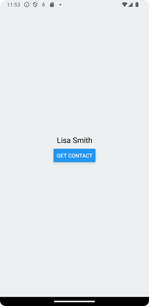
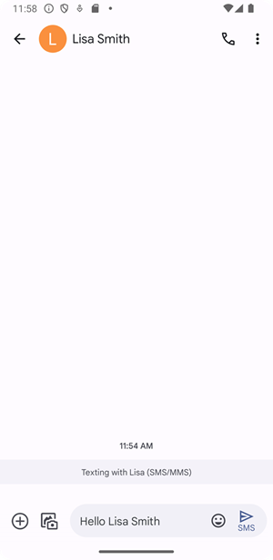

- Contacts can be used to get access your device’s contacts. First, you have to install `expo-contacts` using the following command in your app directory.
```bash
npx expo install expo-contacts 
```
- In the following example, we create an app that fetch phone number from the contacts and send sms message to this number.


- First, we have to import the contacts and sms.
```js
import * as Contacts from 'expo-contacts';
import * as SMS from 'expo-sms';
```
- Next, we have to check permission to be able to access the device’s contacts. 

```js
const { status } = await Contacts.requestPermissionsAsync();
```
- If the permission exists, the status value is `granted`.

```js
if (status === 'granted') {
  // Access contacts 
}
```
- The `getContactsAsync(query)` method is used to get contacts from your device and it is asynchronous.
- The function returns an array of contact objects.

```js
const getContacts = async () => {
  const { status } = await Contacts.requestPermissionsAsync();
  if (status === 'granted') {
    const { data } = await Contacts.getContactsAsync(
      { fields: [Contacts.Fields.PhoneNumbers] }
    );
   }
}
```
- In the functions `query` argument we define that we want to get phone numbers. You can also use for example, `Contacts.Fields.Emails` to get email addresses.
- Then, we can check if there are contacts available, and save the first contact object to a state.

```js
const [contact, setContact] = useState({});

const getContacts = async () => {
  const { status } = await Contacts.requestPermissionsAsync();
  if (status === 'granted') {
    const { data } = await Contacts.getContactsAsync(
      { fields: [Contacts.Fields.PhoneNumbers] }
    );
    if (data.length > 0) {
      setContact(data[0]);
    }
  }
}

```
- Contact object looks the following (Android)

```json
Object {
  "contactType": "person",
  "firstName": "Juha",
  "id": "1",
  "imageAvailable": false,
  "lastName": "Hinkula",
  "lookupKey": "0r1-3B5137293739433D513F29",
  "name": "Juha Hinkula",
  "phoneNumbers": Array [
    Object {
      "id": "1",
      "isPrimary": 0,
      "label": "mobile",
      "number": "1 234-566-985",
      "type": "2",
    },
  ],
}

```
- In the `return` statement, we add the `Button` and `Text` components. The button invokes the `getContact` function and the name of the first contact is shown in the `Text` component.

```jsx
return (
  <View style={styles.container}>
    <Text>{contact.name}</Text>
    <Button title="Get Contact" onPress={getContacts} />
  </View>
);
```
- Now, You should see the first contact’s name when you press the button.



### SMS
- SMS can be used to get access to device’s SMS messages. You can install it by typing the following command in your app directory.
```
npx expo install expo-sms 
```
- Next, we will implement function to send SMS message to the contact.
The `isAvailableAsync()` method can be used to check if SMS is available in you device.

```js
const sendSms = async () => {
  const isSMSAvailable = await SMS.isAvailableAsync();
  
  if (isSMSAvailable) {
    // Send a message
  }
}
```
- The SMS message can be sent using the `sendSMSAsync()` method. The first argument is an array of phone numbers and the second argument is a message.

```js
const sendSms = async () => {
  const isSMSAvailable = await SMS.isAvailableAsync();

  if (isSMSAvailable && contact.phoneNumbers.length > 0) {
    const { result } = await SMS.sendSMSAsync([contact.phoneNumbers[0].number], 
      'Hello ' + contact.name);
  }
}
```
- Finally, we add a button to send SMS message.

```js
return (
  <View style={styles.container}>
    <Text>{contact.name}</Text>
    <Button title="Get Contact" onPress={getContacts} />
    <Button title="Send SMS" onPress={sendSms} />
  </View>
);
```



