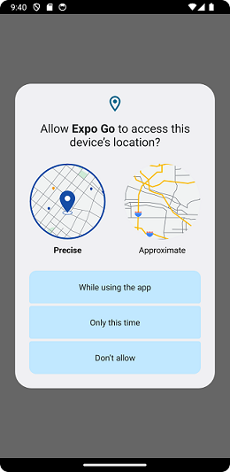

- Location allows to read geolocation data from the device (https://docs.expo.dev/versions/latest/sdk/location).
- Install the `expo-location` library
```
npx expo install expo-location
```
- Import Location to your Component. When using Location we have to check permission  (access to geolocation, contacts etc.).

``` js
import * as Location from 'expo-location';

export default function App() {
  const [location, setLocation] = useState(null); // State where location is saved
 
  useEffect(() => {
    // Get location
  }, []);
}
```
- Certain functionalities requires users permission. App permissions help support user privacy by protecting access to the restricted data (system state and users' contact informatio, etc.) and restricted actions, such as getting device location and recording audio.
- We have to check the permission first using the `useEffect()` hook.
- We use the `requestForegroundPermissionsAsync()` method to check if permission for location usage is granted.
```js
useEffect(() => {
  (async () => {
    let { status } = await Location.requestForegroundPermissionsAsync();
    if (status !== 'granted') {
      Alert.alert('No permission to get location')
      return;
    }
    // Get location
  })();
}, []);
```
- Now, if you open the app in your device, you will see the permission dialog.


- Next, we use the `getCurrentPositionAsync(options)` method to get user's current location. The `options` parameter can be used to set desired accuracy, timeout duration, etc. If not provided, default settings will be used.
```js
useEffect(() => {
  (async () => {
    let { status } = await Location.requestForegroundPermissionsAsync();
    if (status !== 'granted') {
      Alert.alert('No permission to get location')
      return;
    }
    let location = await Location.getCurrentPositionAsync({});
    setLocation(location);
  })();
}, []);
```
- The `getCurrentPositionAsync()` returns an object `coords` that contains attributes like latitude, longitude, altitude, speed etc.