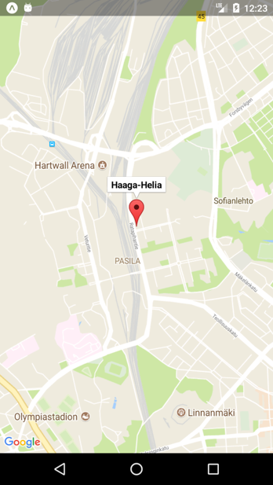

`MapView` is the component that shows Google Map on Android or Apple Map on iOS (https://github.com/react-native-maps/react-native-maps).

In the next example, we use `MapView` component to show Haaga-Helia Pasila campus in the map.



First, we install `react-native-maps` components:
```bash
npx expo install react-native-maps 
```
:::note
When you run `npx expo install` command, it ensures that the installed dependencies are compatible with the current version of Expo that you are using for your project. It is used when you install specific Expo-related dependencies and packages required for your Expo project.
:::

We import `MapView` and `Marker` from the `react-native-maps` to the App component.
```js
import MapView, { Marker } from 'react-native-maps';
```
Finally, we render the `MapView` component in the `return` statement.
```jsx
<MapView
  style={{ width: '100%', height: '100%' }} 
  initialRegion={{
    latitude: 60.200692,
    longitude: 24.934302,
    latitudeDelta: 0.0322,
    longitudeDelta: 0.0221,
  }} 
/>
```
:::info
Use `region` prop instead of `initialRegion` when having region in state (dynamic map). Changing the `initialRegion` prop after the component has mounted will not result in a region change.

For example,

```jsx
// Create a state for region
const [region, setRegion] = useState({
  latitude: 60.200692,
  longitude: 24.934302,
  latitudeDelta: 0.0322,
  longitudeDelta: 0.0221,
})

// Use region prop in the MapView and the value comes from region state
<MapView
  style={{ width: '100%', height: '100%' }} 
  region={region} 
/>
```
:::
The `Marker` component is used to display a marker on a map. To display a marker, we add the `Marker` component inside the `MapView` component. Marker's `coordinate` prop specifies the position of the marker on the map. It takes an object with latitude and longitude properties. Marker's `title` prop allows you to specify a title for the marker. This title is displayed when the marker is tapped by the user on the map.
```jsx
<MapView
  style={{ width: '100%', height: '100%' }} 
  initialRegion={{
    latitude: 60.200692,
    longitude: 24.934302,
    latitudeDelta: 0.0322,
    longitudeDelta: 0.0221,
  }}>
  <Marker
    coordinate={{
      latitude: 60.201373, 
      longitude: 24.934041}}
      title='Haaga-Helia' 
    />
</MapView>
```
Next, we learn how to get current location of your device.