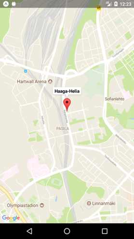

- `MapView` is the component that shows Google Map (Android) or Apple Map (iOS).
- The following example shows Haaga-Helia Pasila campus in the map.
- Install react-native-maps component:
```
npx expo install react-native-maps 
```
- Import `MapView` and `Marker` from the `react-native-maps` to your component.
```js
import MapView, { Marker } from 'react-native-maps';
```
- Render the `MapView` component in the `return`statement.

```jsx
<MapView
  style={{ flex: 1 }} 
  initialRegion={{
    latitude: 60.200692,
    longitude: 24.934302,
    latitudeDelta: 0.0322,
    longitudeDelta: 0.0221,
  }} 
/>
```
:::info
Use `region` prop instead of `initialRegion` when having region in state (dynamic map). For example,

```jsx
// Create a state for region
const [region, setRegion] = useState({
  latitude: 60.200692,
  longitude: 24.934302,
  latitudeDelta: 0.0322,
  longitudeDelta: 0.0221,
})

// Use region prop in the MapView and the value comes from region state
<MapView
  style={{ flex: 1 }} 
  region={region} 
/>
```
:::

- To show marker, add `Marker` inside the `MapView` component.

```jsx
<MapView
  style={{ flex: 1 }}
  initialRegion={{
    latitude: 60.200692,
    longitude: 24.934302,
    latitudeDelta: 0.0322,
    longitudeDelta: 0.0221,
  }}>
  <Marker
    coordinate={{
      latitude: 60.201373, 
      longitude: 24.934041}}
      title='Haaga-Helia' />
</MapView>
```

