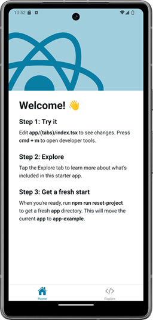

Expo provides Expo Router that is routing library for React Native applications. It is file-based router and when a file is added to the app directory, the file automatically becomes a route in your navigation. Expo Route is based on React Navigation.

Read more in https://docs.expo.dev/router/introduction/

You can easily test expo router by creating expo app without template using the following command:
```bash
npx create-expo-app@latest
```
This command creates an app that includes the Expo Router and some example routes.



