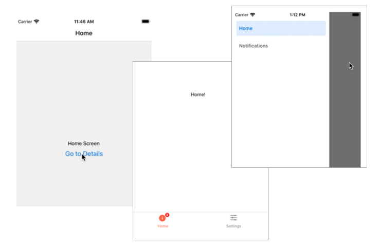
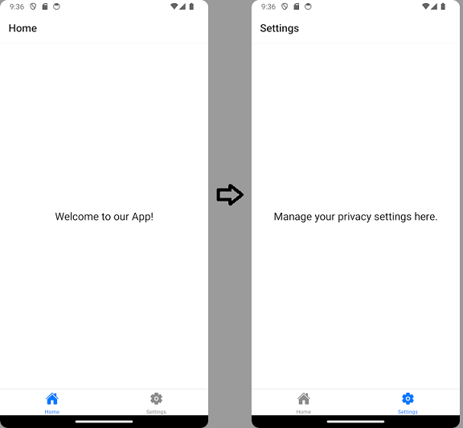
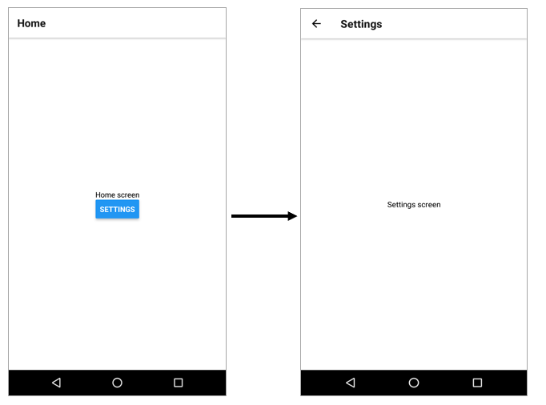
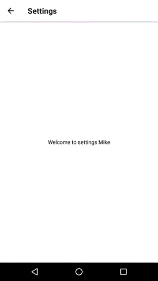

React Navigation (https://reactnavigation.org/) is a popular routing and navigation library for React Native applications.

The following navigation patterns are available:
  - Stack navigator
  - Tab navigator
  - Drawer navigator 



### Installation
Installation of the core library and dependencies (React Navigation v6):
```
npm install @react-navigation/native
npx expo install react-native-screens react-native-safe-area-context
```
### Tab Navigation
In the next example, we implement a bottom tab navigator that provides navigation between the home and settings screens within the application:



- First, create a new React Nativa app and install React Navigator. Create two components that are used in the navigator:

1.)  HomeScreen.js
```jsx
import { View, Text } from 'react-native';

export default function HomeScreen() {
 return (
  <View>
    <Text>This is HomeScreen</Text>
  </View>
 );
};
```
2.) SettingScreen.js

```jsx
import { View, Text } from 'react-native';

export default function SettingScreen() {
  return (
    <View>
      <Text>This is SettingScreen</Text>
    </View>
  );
};
```
- To implement tab navigation, you have to install the `@react-navigation/bottom-tabs` library:
```bash
npm install @react-navigation/bottom-tabs
```
- Import the `NavigationContainer` and `createBottomTabNavigator`. The `NavigatorContainer` serves as the root component for the navigation and it must be rendered at the top level of your React Native application.

```jsx title="App.js"
import { NavigationContainer } from '@react-navigation/native';
import { createBottomTabNavigator } from '@react-navigation/bottom-tabs';

export default function App() {
  return (
    <NavigationContainer>
    </NavigationContainer>
  );
}
```
- Next, we call the `createBottomNavigator` function that allows you to create a tab-based navigation where tabs are displayed at the bottom of the screen. The function returns an object containing two components: `Screen` and `Navigator`.
- The `Navigator` component manages the navigation state and renders the screens based on the current navigation state.
- The `Screen` component represents an individual screen within the navigator.
```jsx title="App.js"
import { NavigationContainer } from '@react-navigation/native';
import { createBottomTabNavigator } from '@react-navigation/bottom-tabs';

// highlight-next-line
const Tab = createBottomTabNavigator();
  
export default function App() {
  return (
    <NavigationContainer>
    </NavigationContainer>
  );
}
```
- Finally, we can set-up the navigator. The `Screen` component's `name` prop defines the name that is used for screen. The name is also used to navigate to the screen. The `component` prop defines the React component to render for the screnn.

```jsx title="App.js"
import { NavigationContainer } from '@react-navigation/native';
import { createBottomTabNavigator } from '@react-navigation/bottom-tabs';
import HomeScreen from './HomeScreen'
import SettingScreen from './SettingScreen'
  
const Tab = createBottomTabNavigator();
  
export default function App() {
  return (
    <NavigationContainer>
      // highlight-start
      <Tab.Navigator>
        <Tab.Screen name="Home" component={HomeScreen} />
        <Tab.Screen name="Settings" component={SettingScreen} />
      </Tab.Navigator>
      // highlight-end
    </NavigationContainer>
  );
}
```
- Now, you should see the bottom tab naviagtor in your app and you are able to navigate between two components.

#### Tab icons
- Expo provides icon library that can be used to show icons in your app (https://docs.expo.dev/guides/icons/).
- To use icons, you have to import `Ionicons` component:
```js
import Ionicons from '@expo/vector-icons/Ionicons';
```
- Then, you can render an icon. The `name` props defines what icon to show. You can explore different icons from: https://icons.expo.fyi/
```
  <Ionicons name="home" size={32} color="red" />
```
- In the next slide, we will render icons to our tab navigation bar by using the `screenOptions` props of the `Navigator` component.

```jsx
<NavigationContainer>
  <Tab.Navigator
    screenOptions={({ route }) => ({  // Navigator can be customized using screenOptions
          tabBarIcon: ({ focused, color, size }) => { 
            // Function tabBarIcon is given the focused state,
	    // color and size params
            let iconName;

            if (route.name === 'Home') {
              iconName = 'home';
            } else if (route.name === 'Settings') {
              iconName = 'settings';
            }

            return <Ionicons name={iconName} size={size} color={color} />;   //it returns an icon component
          },
        })}>
        <Tab.Screen name="Home" component={HomeScreen} />
        <Tab.Screen name="Settings" component={SettingScreen} />
      </Tab.Navigator>
    </NavigationContainer>

```
### Stack Navigation

- Install @react-navigation/native-stack
```
npm install @react-navigation/native-stack
```
- Import `NavigationContainer` and `createStackNavigator` to the App.jsx file
```js	
import { NavigationContainer } from '@react-navigation/native';
import { createNativeStackNavigator } from '@react-navigation/native-stack';
```
- Use the `createNativeStackNavigator`

```js
const Stack = createNativeStackNavigator();
```
- Now, the App.jsx source code looks like the following:
```jsx
import { NavigationContainer } from '@react-navigation/native';
import { createNativeStackNavigator } from '@react-navigation/native-stack';
import HomeScreen from './HomeScreen'
import SettingScreen from './SettingScreen'
  
const Stack = createNativeStackNavigator();
  
export default function App() {
  return (
    <NavigationContainer>
      <Stack.Navigator>
        <Stack.Screen name="Home" component={HomeScreen} />
        <Stack.Screen name="Settings" component={SettingScreen} />
      </Stack.Navigator>
    </NavigationContainer>
  );
}
```
- Add a button for navigation to your HomeScreen component 
```js
// Add also imports
// navigation prop is passed in to every screen component (definition) in stack navigator
// navigation prop has navigate function that can be used to navigate between screens
export default function HomeScreen({ navigation }) {
  return (
    <View style={{ flex: 1, alignItems: 'center', justifyContent: 'center' }}>
      <Text>Hello screen</Text>
      <Button
        title="Settings"
        onPress={() => navigation.navigate('Settings')} // Navigate to Settings screen
      />
    </View>
  );
}
```


#### Passing parameters between pages
- Parameters can be passed by using the navigator's `route` props.

```js
// HomeScreen.js

return (
  <View style={styles.container}>
    <Text>Home screen</Text>
    <Button 
      onPress={() => navigation.navigate('Settings', {user: 'Mike'})}
      title="Settings" />
  </View>
);

```
- Settings screen can now access the passed params

```js
// SettingsScreen.js
function SettingsScreen({ route, navigation }) 
  const { user } = route.params;
  
  return(
    <View style={styles.container}>
      <Text>Welcome to settings {user}</Text>
    </View>
  );
}
```

