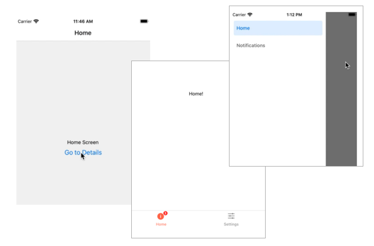
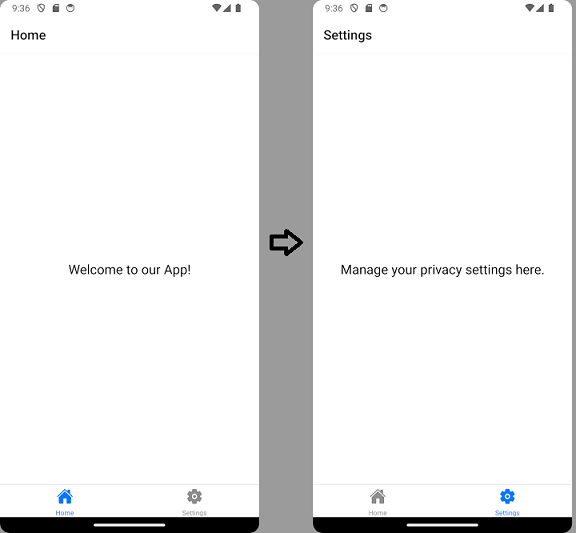
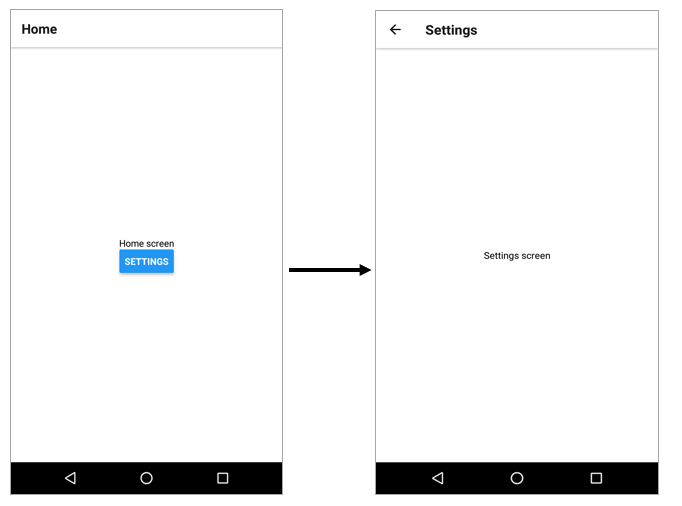
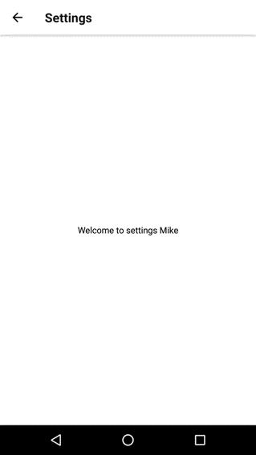

React Navigation (https://reactnavigation.org/) is a popular routing and navigation library for React Native applications.

The following navigation patterns are available:
  - Stack navigator
  - Tab navigator
  - Drawer navigator 



### Installation
Installation of the core library and dependencies (React Navigation v6):
```
npm install @react-navigation/native
npx expo install react-native-screens react-native-safe-area-context
```
### Tab Navigation
In the next example, we implement a bottom tab navigator that provides navigation between the home and settings screens within the application:



First, create a new React Native app and install React Navigation. Create two components that are used in the navigator:

```jsx title="HomeScreen.tsx"
import { StyleSheet, Text, View } from 'react-native';

export default function HomeScreen() {
  return (
    <View style={styles.container}>
      <Text>Welcome to our App!</Text>
    </View>
  );
}

const styles = StyleSheet.create({
  container: {
    flex: 1,
    backgroundColor: '#fff',
    alignItems: 'center',
    justifyContent: 'center',
  },
});
```
```jsx title="SettingScreen.tsx"
import { StyleSheet, Text, View } from 'react-native';

export default function SettingScreen() {
  return (
    <View style={styles.container}>
      <Text>Manage your privacy settings here.</Text>
    </View>
  );
}

const styles = StyleSheet.create({
  container: {
    flex: 1,
    fontSize: 20,
    backgroundColor: '#fff',
    alignItems: 'center',
    justifyContent: 'center',
  },
});

```
To implement tab navigation, we have to install the `@react-navigation/bottom-tabs` library:
```bash
npm install @react-navigation/bottom-tabs
```
Import the `NavigationContainer` and `createBottomTabNavigator`. The `NavigatorContainer` serves as the root component for the navigation and it must be rendered at the top level of your React Native application.

```jsx title="App.tsx"
import { NavigationContainer } from '@react-navigation/native';
import { createBottomTabNavigator } from '@react-navigation/bottom-tabs';

export default function App() {
  return (
    <NavigationContainer>
    </NavigationContainer>
  );
}
```
Next, we call the `createBottomNavigator` function that allows you to create a tab-based navigation where tabs are displayed at the bottom of the screen. The function returns an object containing two components: `Screen` and `Navigator`. 

The `Navigator` component manages the navigation state and renders the screens based on the current navigation state. The `Screen` component represents an individual screen within the navigator.
```jsx title="App.js"
import { NavigationContainer } from '@react-navigation/native';
import { createBottomTabNavigator } from '@react-navigation/bottom-tabs';

// highlight-next-line
const Tab = createBottomTabNavigator();
  
export default function App() {
  return (
    <NavigationContainer>
    </NavigationContainer>
  );
}
```
Finally, we can set-up the navigator. The `Screen` component's `name` prop defines the name that is used for screen. The name is also used to navigate to the screen. The `component` prop defines the React component to render for the screnn.

```jsx title="App.tsx"
import { NavigationContainer } from '@react-navigation/native';
import { createBottomTabNavigator } from '@react-navigation/bottom-tabs';
import HomeScreen from './HomeScreen'
import SettingScreen from './SettingScreen'
  
const Tab = createBottomTabNavigator();
  
export default function App() {
  return (
    <NavigationContainer>
      // highlight-start
      <Tab.Navigator>
        <Tab.Screen name="Home" component={HomeScreen} />
        <Tab.Screen name="Settings" component={SettingScreen} />
      </Tab.Navigator>
      // highlight-end
    </NavigationContainer>
  );
}
```
Now, we should see the bottom tab naviagtor in our app and we are able to navigate between two components.

:::note
React Navigation offers two methods for implementing routing: **static** and **dynamic**.  In this material we use the dynamic (component) method where routing is defined using components. In the static method, routing is defined  using objects. For example, the previous example look like this when using static navigation:

```tsx
import { createBottomTabNavigator } from '@react-navigation/bottom-tabs';
import { createStaticNavigation } from '@react-navigation/native';

const Tabs = createBottomTabNavigator({
  screens: {
    Home: HomeScreen,
    Settings: SettingsScreen,
  },
});

const Navigation = createStaticNavigation(Tabs);

export default function App() {
  return <Navigation />;
}
```
:::

#### Tab icons
Expo provides icon library that can be used to show icons in your app (https://docs.expo.dev/guides/icons/).

To use icons, you have to import `Ionicons` component:
```js
import Ionicons from '@expo/vector-icons/Ionicons';
```
Then, you can render an icon. The `name` props defines what icon to display. You can explore different icons in: https://icons.expo.fyi/
```tsx
  <Ionicons name="home" size={32} color="red" />
```
Next, we'll add icons to our tab navigation bar by utilizing the `screenOptions` property of the `Navigator` component.
```tsx
<NavigationContainer>
  <Tab.Navigator
    screenOptions={({ route }) => ({  // Navigator can be customized using screenOptions
          tabBarIcon: ({ focused, color, size }) => { 
            // Function tabBarIcon is given the focused state,
	    // color and size params
            let iconName;

            if (route.name === 'Home') {
              iconName = 'home';
            } else if (route.name === 'Settings') {
              iconName = 'settings';
            }

            return <Ionicons name={iconName} size={size} color={color} />;   //it returns an icon component
          },
        })}>
        <Tab.Screen name="Home" component={HomeScreen} />
        <Tab.Screen name="Settings" component={SettingScreen} />
      </Tab.Navigator>
    </NavigationContainer>

```
### Stack Navigation
In the following example, we'll demonstrate navigating between two screens using stack navigation.



To use stack navigation, we have to Install `@react-navigation/native-stack` library:
```bash
npm install @react-navigation/native-stack
```
Import `NavigationContainer` and `createStackNavigator` to the App.js file
```js	title="App.tsx"
import { NavigationContainer } from '@react-navigation/native';
import { createNativeStackNavigator } from '@react-navigation/native-stack';
```
We call the `createNativeStackNavigator` function and render the navigator and screens. Now, the App.js source code looks like the following:
```tsx title="App.tsx"
import { NavigationContainer } from '@react-navigation/native';
import { createNativeStackNavigator } from '@react-navigation/native-stack';
import HomeScreen from './HomeScreen'
import SettingScreen from './SettingScreen'
  
const Stack = createNativeStackNavigator();
  
export default function App() {
  return (
    <NavigationContainer>
      <Stack.Navigator>
        <Stack.Screen name="Home" component={HomeScreen} />
        <Stack.Screen name="Settings" component={SettingScreen} />
      </Stack.Navigator>
    </NavigationContainer>
  );
}
```
We add a button to our `HomeScreen` component. When the button is pressed, the user is navigated to the settings screen. The component receives a props that includes the `navigation` object, which contains the `navigate` function for screen navigation. You can read more about the `navigation` object at https://reactnavigation.org/docs/navigation-object.
```tsx
// navigation prop is passed in to every screen component in stack navigator
export default function HomeScreen({ navigation }) {
  return (
    <View style={styles.container}>
      <Text>Home screen</Text>
      <Button
        title="Settings"
        onPress={() => navigation.navigate('Settings')} // Navigate to the Settings screen
      />
    </View>
  );
}
```
#### Passing parameters between pages
Parameters can be passed by using the navigator's props that contains `route` object. You can read more about the `route` object at https://reactnavigation.org/docs/route-object.

We can add type-check to screen names and params when using React Navigation. You can read about type-checking in https://reactnavigation.org/docs/typescript.

Let's create `types.ts` file in the `/src` directory. We declare type that maps each screen name to the parameters it accepts:

```ts title="types.ts"
export type RootStackParamList = {
  Home: undefined;
  Settings: { userId: string };
};
```
This gives TypeScript a picture of your navigation structure, so it can catch errors in the development phase. For example, navigating to missing screen or passing the wrong params.

`NativeStackScreenProps` is a built-in React Navigation type that automatically gives your screen component two typed props: `navigation` and `route`.

```ts title="types.ts"
export type RootStackParamList = {
  Home: undefined;
  Settings: { userId: string };
};

export type RootStackScreenProps<T extends keyof RootStackParamList> =
  NativeStackScreenProps<RootStackParamList, T>;
```
`T` is a generic type parameter constrained to be one of the screen name keys.  So only 'Home' or 'Settings' are valid values (based on our `RootStackParamList`). Passing any other string is a compile time error.

Then, we pass `RootStackParamList` as a generic type argument to `createNativeStackNavigator`.

```tsx title="App.tsx"
import { NavigationContainer } from '@react-navigation/native';
import { createNativeStackNavigator } from '@react-navigation/native-stack';
import HomeScreen from './HomeScreen'
import SettingScreen from './SettingScreen'
import type { RootStackParamList } from '.\types'
  
const Stack = createNativeStackNavigator<RootStackParamList>();
  
export default function App() {
  return (
    <NavigationContainer>
      <Stack.Navigator>
        <Stack.Screen name="Home" component={HomeScreen} />
        <Stack.Screen name="Settings" component={SettingScreen} />
      </Stack.Navigator>
    </NavigationContainer>
  );
}
```
In `HomeScreen`, we define what type the `navigation` prop should be by using `RootStackScreenProps`. The `<'Home'>` part is a generic type argument and it narrows the type to just the home screen. Then TypeScript can catch mistakes like navigating to a screen that doesn't exist.
```tsx title="HomeScreen.tsx"
import { StyleSheet, Text, View, Button } from 'react-native';
import type { RootStackScreenProps } from './types';

export default function HomeScreen({ navigation }: RootStackScreenProps<'Home'>) {
  return (
    <View style={styles.container}>
      <Text>Home screen</Text>
      <Button
        title="Settings"
        onPress={() => navigation.navigate('Settings', { userId: "johndoe" })} // Navigate to the Settings screen
      />
    </View>
  );
}
```
In `SettingScreen`, we define what type the `route` prop should be by using `RootStackScreenProps`. Then TypeScript knows exactly what parameters the Settings screen expects (in this case, `{ userId: string }`). 
```tsx title="SettingScreen.tsx"
import { StyleSheet, Text, View } from 'react-native';
import type { RootStackScreenProps } from './types';

export default function SettingsScreen({ route }: RootStackScreenProps<'Settings'>) {
  const { userId } = route.params;
  
  return(
    <View style={styles.container}>
      <Text>Welcome to settings {userId}</Text>
    </View>
  );
}
```

