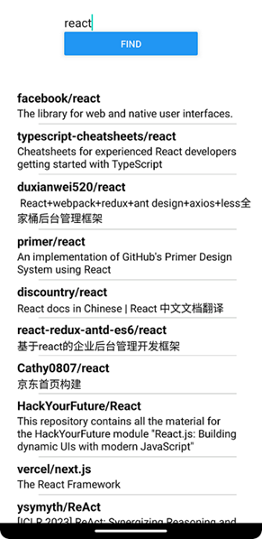
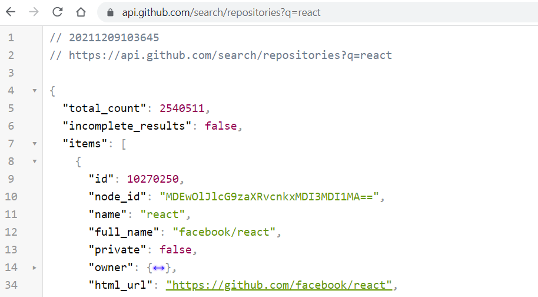

In the following example, we utilize the GitHub API to search for repositories based on a keyword provided by the user. User can type a keyword and after pressing the button, we fetch the repositories matching the keyword and display them in a list.



We need states to store data that we get from the response and for keyword that we use in the query parameter.
```js
// Import useState hook function
import { useState } from 'react';

// declare states
const [keyword, setKeyword] = useState('');
const [repositories, setRepositories] = useState([]);
```
The following URL is used to get repositories by keyword. Response contains an `item` node that is an array of repository objects. We will display both the full name and description of each repository.

https://api.github.com/search/repositories?q={keyword}



The `return` statement includes `TextInput` and `Button` components. The `TextInput` component allows users to input a keyword and we store it in the `keyword` state. The Button component triggers the execution of a fetch request when pressed.
```jsx
return (
  <View style={styles.container}>
    <TextInput 
      style={{fontSize: 18, width: 200}} 
      placeholder='keyword' 
      value={keyword}
      onChangeText={text => setKeyword(text)} 
    />
    <Button title="Find" onPress={handleFetch} />
  </View>
);
```
The `handleFetch` function executes the request and gets a query parameter from the `keyword` state. Result array is saved to the `repositories` state from the response.
```js
const handleFetch = () => {
  fetch(`https://api.github.com/search/repositories?q=${keyword}`)
  .then(response => {
    if (!response.ok)
      throw new Error("Error in fetch:" + response.statusText);
      
    return response.json()
  })
  .then(data => setRepositories(data.items))
  .catch(err => console.error(err));    
}
```
Next, we add `FlatList` component to show response data in the `return` statement. We display both the full name and description of the repositories.
```jsx
return (
  <View style={styles.container}>
    <TextInput 
      style={{fontSize: 18, width: 200}} 
      placeholder='keyword' 
      value={keyword}
      onChangeText={text => setKeyword(text)} 
    />
    <Button title="Find" onPress={handleFetch} />
    // highlight-start
    <FlatList
      data={repositories} 
      keyExtractor={(item) => item.id}
      renderItem={({item}) =>
        <View>
          <Text style={{fontSize: 18, fontWeight: "bold"}}>
            {item.full_name}
          </Text>
          <Text style={{fontSize: 16 }}>
            {item.description}
          </Text>
        </View>}
    /> 
    // highlight-end
  </View>
);
```
The `ActivityIndicator` component in React Native is a visual indicator that represents the progress of an operation (https://reactnative.dev/docs/activityindicator). Next, we utilize that to show progress of fetch operation. First, we import the `ActivityIndicator` component from React Native.

We add a new state variable called `loading` to track whether the fetch operation is in progress.
```js
import { useState } from 'react';
import { StyleSheet, Text, View, Button, TextInput, 
          FlatList, StatusBar, ActivityIndicator } from 'react-native';

export default function App() {
  const [keyword, setKeyword] = useState('');
  const [repositories, setRepositories] = useState([]);
  // highlight-next-line
  const [loading, setLoading] = useState(false);
 // continue...
```
In the `handleFetch` function, we set `loading` state to `true` before sending the request and set it back to `false` after the request completes or encounters an error.
```js
const handleFetch = () => {
  // highlight-next-line
  setLoading(true); // Set loading state to true before fetch
    
  fetch(`https://api.github.com/search/repositories?q=${keyword}`)
  .then(response => {    
    if (!response.ok)
      throw new Error("Error in fetch:" + response.statusText);
      
    return  response.json()
  })
  .then(data => setRepositories(data.items))
  .catch(err => console.error(err))
  // highlight-next-line
  .finally(() => setLoading(false)); // Set loading state to false   
}
```
Finally, we use conditional rendering to display `ActivityIndicator` component when the `loading` state is `true`.
```jsx
 return (
    <View style={styles.container}>
      <StatusBar hidden={true} />
      <TextInput style={{fontSize: 18, width: 200}} placeholder='keyword' 
        onChangeText={text => setKeyword(text)} />
      <Button title="Find" onPress={handleFetch} />
      
      {/* Display ActivityIndicator when loading is true */}
      {loading && <ActivityIndicator size="large" />}
      
      <FlatList 
        style={{margin: "3%"}}
        keyExtractor={item => item.id} 
        renderItem={({item}) => 
          <View>
            <Text style={{fontSize: 18, fontWeight: "bold"}}>{item.full_name}</Text>
            <Text style={{fontSize: 16 }}>{item.description}</Text>
          </View>}
        data={repositories} /> 
    </View>
  );
}
```
:::info[Task]
Refactor the GitHub API app by splitting it into smaller, more manageable components. Specifically:

- Create a separate component for the list that displays repositories.
- Create a separate file for the REST API calls.
- Read the next section about environment variables and configure the API URL to be read from a `.env` file.
:::