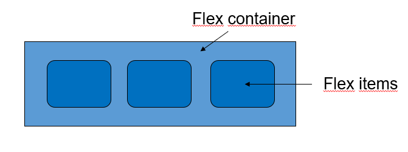
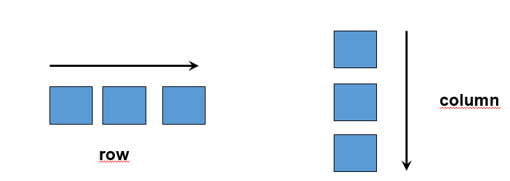
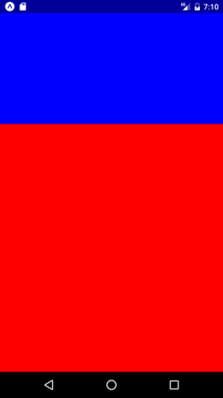
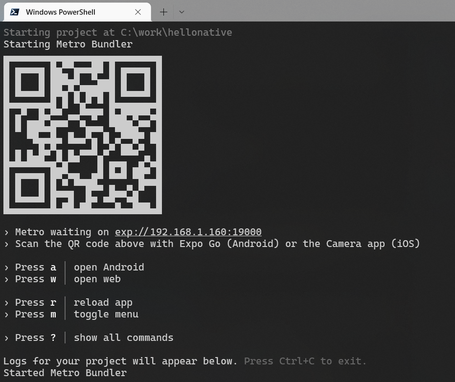
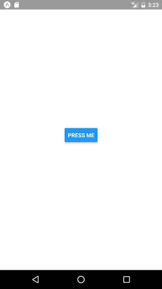
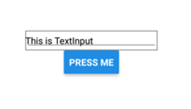

- **React Native** is framework for building mobile apps with Javascript (or TypeScript) and React
- Developed by Meta https://reactnative.dev/
- React Native uses same UI elements as native Android and IOS apps


### Comparison to other frameworks

#### Native Android and IOS
- Performance (pros)
- Native look & feel (pros)
- Security (pros)
- Different codebase & technologies between platforms (cons)

---
#### Hybrid App (Cordova, Phonegap, etc.)

- Performance (cons)
- Weak native look and feel (cons)
- Security (cons)
- One codebase & technology (pros)
---
#### React Native & Google Flutter
- Performance (pros)
- Native look and feel (pros)
- One codebase & technology (pros)
- Lack of some components (cons)
React Native provides possibility to write native code when high performance is needed or some functionalities are missing from React Native
---

- Web elements are not used with React Native
- React Native provides mobile components which can be used to create mobile apps
- Some of the most common components
  `<View>` - container that supports layout with flexbox
  `<Button>` - basic button component
  `<Image>` - component for displaying images
  `<TextInput>` - component for text input


### Layout
- Layout can be defined by using **flexbox**
- Flexbox works same way in React Native as it works with CSS in HTML
- Parent container becomes Flex container and all its childs becomes Flex items.



### Common flexbox attributes

#### **`flexDirection`**

- Defines the direction how components are organized inside the container (horizontally or vertically). The default is vertically (Note, different than in web!).
- `flexDirection` also defines the **primary axis**
  

#### **`flex`**

- Defines how the space is divided between multiple flex containers

```jsx
<View style="{{flex:" 1}}>
  <View style="{{flex:" 1}}> Some components goes here - 1/3 space </View>
  <View style="{{flex:" 2}}> Some components goes here - 2/3 space </View>
</View>
```


#### **`alignItems`**
-Defines the alignment of childrens in the secondary axis. If `flexDirection` is `row` then the secondary axis is `column` and vice versa.
-Options: `center`, `flex-start`, `flex-end`, `stretch`

```jsx
<View style={{flex: 1, flexDirection: 'row',
  alignItems: 'center'}}>
  <Button title="Button1" onPress={buttonPressed}/>
  <Button title="Button2" onPress={buttonPressed}/>
  <Button title="Button3" onPress={buttonPressed}/>
</View>
```


#### **`justifyContent`**
- Defines the distribution of childrens in the **primary** axis.
  -Options: `center`, `flex-start`, `flex-end`, `space-around`,
  `space-between`

```jsx
<View style={{flex: 1, flexDirection: 'row',
  alignItems: 'center', justifyContent: 'space-around'}}>
  <Button title="Button1" onPress={buttonPressed}/>
  <Button title="Button2" onPress={buttonPressed}/>
  <Button title="Button3" onPress={buttonPressed}/>
</View>
```


---

## EXPO
- Easiest way to create a new React Native app is using **Expo**
- Node.js LTS release version is required
- Create your first app and run it

```bash
npx create-expo-app YOUR_APP_NAME
cd YOUR_APP_NAME
npx expo start
```

**Note:** Linux and macOS users have to install Watchman. See more from https://docs.expo.io/get-started/installation/

- If you can't get app loading to your device, you can use tunnel connection type. Start your app using the following command:

```bash
npx expo start --tunnel
```
- Expo opens Metro Bundler in your terminal after you run your app.
- Install EXPO app to your mobile device
- Android: Read the QR code with the EXPO app
- iOS: Read the QR code using the device camera
- You can also run your app in emulator or USB connected device.



- Open your expo project using the VSCode.
- Modify `return` statement in the **App.js** file.

```jsx
return (
  <View style={styles.container}>
    <Text>Hello World!</Text>
  </View>
);
```


## React Native: Components

**`View`** - Container component that supports flexbox layout.

```js
import { View } from "react-native";

return <View style={styles.container}>// Items</View>;
```

- React Native provides also `<ScrollView>` component that is generic scrolling container (https://reactnative.dev/docs/scrollview).

---

### Text

**`Text`** - Component for displaying text.

- Import the `Text` component from React Native.

```js
import { Text, View } from "react-native";
```

- Render the `Text` component.

```js
return (
  <View style={styles.container}>
    <Text>This is text</Text>
  </View>
);
```

### Button

**`Button`**
- Import the `Button` component from React Native.

```js
import { Button, View } from "react-native";
```

- Render the `Button` component.

```js
return (
  <View>
    <Button onPress={buttonPressed} title="Press me" />
  </View>
);
```

- Pressing the button will show an alert. Note: You have to import also `Alert` component.

```js
const buttonPressed = () => {
  Alert.alert("Button pressed");
};
```



### TextInput

**`TextInput`** – component for text input

- Import the `TextInput` component from React Native.

```js
import { View, Button, Alert, TextInput } from "react-native";
```

- Define a new state where typed input is saved.

```js
const [text, setText] = useState("");
```

- Render the `TextInput` component.

```html
<TextInput style={{width: 200, borderColor: 'gray', borderWidth: 1}}
onChangeText={text => setText(text)} value={text} />
```

- Typed text is saved to the `text` state.
- Then, we define `buttonPressed` function that shows `text` state value using the `Alert` component.

```js
const buttonPressed = () => {
  Alert.alert("You typed:" + text);
};
```

- Finally, import and render the `Button` component.

```html
<button onPress="{buttonPressed}" title="Press me" />
```



### Image

**`Image`** – component for displaying images

- Import the `Image` component from React Native.

```js
import { View, Image } from "react-native";
```

- Render the `Image` component (**local image**)

```html
<Image style={{width:250, height: 100}}
source={require('./img/haaga-helia.jpg')} />
```

- In the case of remote URI image, the source is defined in following way:

```jsx
source={{uri: 'IMAGE_URI'}}
```
- `Image` component
  


## React Native: Styling

- Most of the core components has a property called `style` that can be used for inline styling. Style is a javascript object

```html
<Text style={{ fontSize:18, color: 'red' }}>Red text</Text>
```

The better way is to use `StyleSheet` component

- Import the `StyleSheet` component

```js
import { StyleSheet, Text } from "react-native";
```

- Create a stylesheet

```js
const styles = StyleSheet.create({
  alerttext: {
    fontSize: 18,
    color: "red",
  },
});
```

- Use stylesheet in the `style` attribute

```jsx
<Text style="{styles.alerttext}">Red text</Text>
```

### Flatlist

**`FlatList`** - list component with some nice features (header, footer, scroll etc.)

- Import the `FlatList` component from React Native

```js
import {
  StyleSheet,
  Text,
  View,
  Button,
  TextInput,
  FlatList,
} from "react-native";
```

- Declare new states that are used for text input and `FlatList` items

```js
const [text, setText] = useState("");
const [data, setData] = useState([]);
```
- Render the `FlatList` component

```jsx
<FlatList data={data} renderItem={({item}) => <Text>{item.key}</Text>}
keyExtractor={(item, index) => index.toString()} />
```
- `renderItem` prop defines how data items are rendered
- `data` prop defines where data comes from. The value must be an array.
- `keyExtractor` prop extract a unique key for each item.

- Insert typed text from the `TextItem` component to the `data` state when button is pressed (Use spread syntax).

```js
const buttonPressed = () => {
  setData([...data, { key: text }]);
  setText("");
};
```


## React Native APIs

React Native provides some useful APIs that you can use in your apps, for example:

- `Platform` API can be used to get information about current platform

```jsx
import React from "react";
import { Platform, Text, View } from "react-native";

function App() {
  return (
    <View>
      <Text>OS</Text>
      <Text>{Platform.OS}</Text>
      <Text>OS Version</Text>
      <Text>{Platform.Version}</Text>
    </View>
  );
}
```

- `Dimensions` API can be used to get app window dimensions.

```js
import React from "react";
import { Dimensions } from "react-native";

function App() {
  const windowWidth = Dimensions.get("window").width;
  const windowHeight = Dimensions.get("window").height;

  // continues...
}
```

- Note! Dimensions can change for example, due to rotation. There is also `useWindowDimensions` hook that automatically updates width and height.


- `Keyboard` API can be used to listen events and make changes to the keyboard.

- You can for example dismiss the keyboard using the `Keyboard.dismiss()` method.

See more APIs from the React Native documentation.
