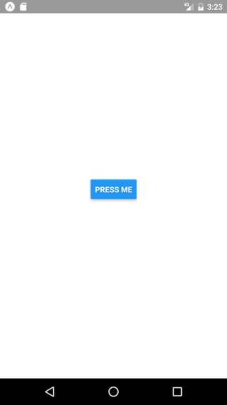

### View 
- `View` is container component that supports flexbox layout.
- It is used to group and structure other components within your application. 

```jsx
import { View } from "react-native";

return (
  <View style={styles.container}>
    <View>
      // Components
    </View>
    <View>
      // Components
    </View>
  </View>
);
```
- Read more in https://reactnative.dev/docs/view
- React Native provides also `<ScrollView>` component that is generic scrolling container (https://reactnative.dev/docs/scrollview).

### Text
- `Text` is component for displaying text.

#### Using the `Text` component:
- Import the `Text` component from React Native.

```js
import { Text, View } from "react-native";
```
- Render the `Text` component.
```jsx
return (
  <View style={styles.container}>
    <Text>This is text</Text>
  </View>
);
```
- Read more in https://reactnative.dev/docs/text

### Button
- `Button` component provides a basic button for user interaction

#### Using the `Button` component:
- Import the `Button` component from React Native.
```js
import { Button, View } from "react-native";
```
- Render the `Button` component.

```jsx
return (
  <View>
    <Button onPress={buttonPressed} title="Press me" />
  </View>
);
```
- Pressing the button will show an alert. Note: You have to import also `Alert` component.
```js
const buttonPressed = () => {
  Alert.alert("Button pressed");
};
```



- Read more in https://reactnative.dev/docs/button

### Pressable
- `Button` component support limited level of customization. You can use `Pressable` component to build yuor own button.
- For example, to get rounded red button:
```jsx
import { Pressable, Text, StyleSheet } from 'react-native';

const RoundedRedButton = () => {
  return (
    <Pressable
      style={({ pressed }) => [
        styles.button,
        { backgroundColor: pressed ? 'darkred' : 'red' },
      ]}
      onPress={() => console.log('Button pressed')}
    >
      <Text style={styles.buttonText}>Press me</Text>
    </Pressable>
  );
};

const styles = StyleSheet.create({
  button: {
    borderRadius: 25,
    paddingVertical: 10,
    paddingHorizontal: 20,
    justifyContent: 'center',
    alignItems: 'center',
  },
  buttonText: {
    color: 'white',
    fontSize: 16,
  },
});

export default RoundedRedButton;

```
- Read more in https://reactnative.dev/docs/pressable

### TextInput
- `TextInput` component allows users to enter and edit single or multiline text.

#### Using the `TextInput` component:
- Import the `TextInput` component from React Native.

```js
import { View, Button, Alert, TextInput } from "react-native";
```

- Define a new state where typed input is saved.

```js
const [text, setText] = useState("");
```

- Render the `TextInput` component.

```jsx
<TextInput style={{width: 200, borderColor: 'gray', borderWidth: 1}}
onChangeText={text => setText(text)} value={text} />
```

- Typed text is saved to the `text` state.
- Then, we define `buttonPressed` function that shows `text` state value using the `Alert` component.

```js
const buttonPressed = () => {
  Alert.alert("You typed:" + text);
};
```
- Finally, import and render the `Button` component.
```jsx
<button onPress="{buttonPressed}" title="Press me" />
```


- Read more in https://reactnative.dev/docs/textinput

### Image
- **`Image`** is component for displaying images

#### Using the `Image` component:
- Import the `Image` component from React Native.

```js
import { View, Image } from "react-native";
```

- Render the `Image` component (**local image**)

```jsx
<Image style={{width:250, height: 100}}
source={require('./img/haaga-helia.jpg')} />
```
- In the case of remote URI image, the source is defined in following way:
```jsx
source={{uri: 'IMAGE_URI'}}
```


- You can find more core components in https://reactnative.dev/docs/components-and-apis