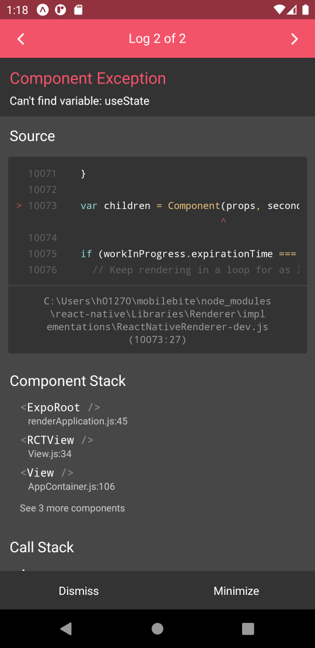
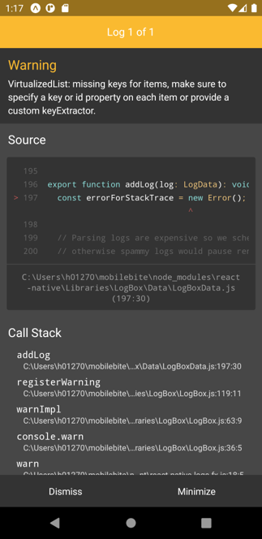
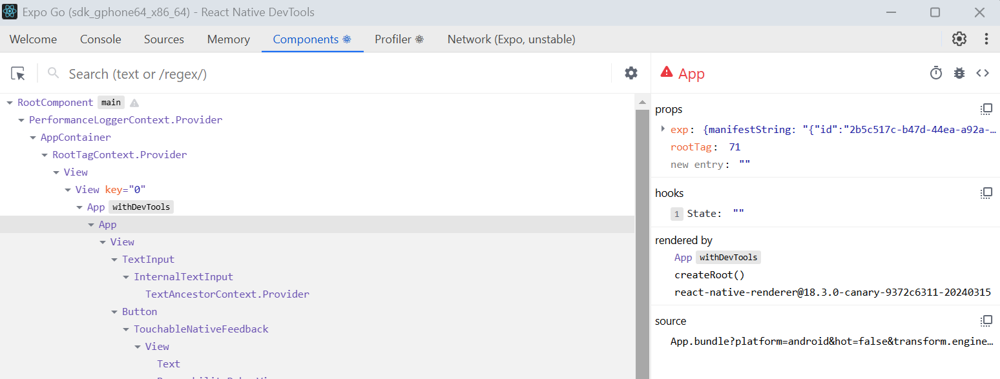

### Errors & Warnings

Fatal errors in the React Native are visually indicated through a red box. Read the error message carefully. The reason for an error is shown there with the reference to your source code. You can also see the error message in your terminal.



Warnings in React Native are displayed using a yellow box.


You can also generate your own errors and warnings by using `console.error` or `console.warn`.

For example:
```js
console.warn("Hello there");
```


### Debugging using React Native Devtools
You can use Chrome DeveTools for debugging the Expo apps. Open the DevTools by pressing ***j*** in the terminal when you app is running.

You can also use the Expo developer menu to open the React Native Devtools. To open the menu, shake your device. The Expo developer menu allows you to reload your app on the device (if fast refresh doesn't work). You can open the React Native Devtools by selecting **Open JS debugger** from the menu.



:::note
React Native Devtools requires either Google Chrome or Microsoft Edge installed. 
:::

The **Console** tab can be uaed to see logged messages and inspect objects.

The **Sources** tab can be used to view source files, set breakpoints to your source code, monitor variables and watch expressions.

The **Components** tab can be used to inspect your app's component hierarchy. You can view component props and states.

Read more in https://reactnative.dev/docs/react-native-devtools.