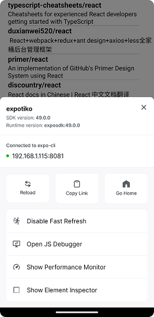
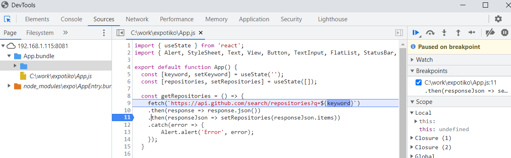

### Errors & Warnings

Fatal errors in the React Native are visually indicated through a red box. Read the error message carefully. The reason for an error is shown there with the reference to your source code. You can also see the error message in your terminal.


Warnings in React Native are displayed using a yellow box.


You can also generate your own errors and warnings by using `console.error` or `console.warn`.

For example:
```js
console.warn("Hello there");
```


### Debugging using Chrome Devtools
You can use Chrome DeveTools for debugging the Expo apps. Open the developer menu by pressing ***m*** in the terminal.



Select ***Open JS Debugger*** from the menu. That opens Chrome DevTools. You can set breakpoints in the Sources tab as shown in the next screenshot:



You can also debug network requests in the Network tab.

- There is also VS Code Expo Tools extension that can be used for debugging (https://github.com/expo/vscode-expo#readme)
