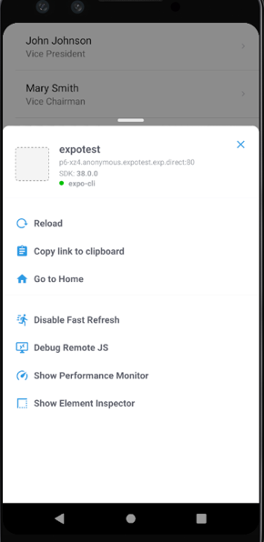
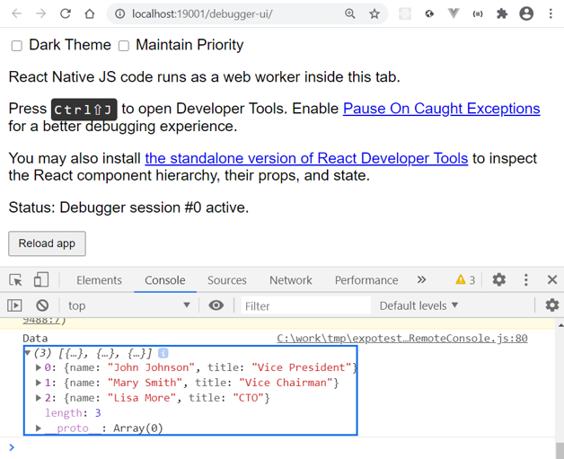

### Errors & Warnings

- Fatal errors in the React Native are visually indicated through a red box. Read the error message carefully. The reason for an error is shown there with the reference to your source code. You can also see the error message in your terminal.


- Warnings in React Native are displayed using a yellow box.


- You can also generate your own errors and warnings by using `console.error` or `console.warn`.
- For example:
```js
console.warn("Hello there");
```


- You can use Chrome or Safari Developer tools for debugging the Expo apps.
- Open the developer menu in your device and select Debug Remote JS



- That will open browser and now you can use `console.log` to print out to the console.
- For example:

```js
console.log("Data", data);
```
- Log messages are also shown in the terminal.




- There is also VS Code Expo Tools extension that can be used for debugging (https://github.com/expo/vscode-expo#readme)

### React Developer Tools

- React Developer Tools can be used with React Native & Expo. You can open it by pressing **_shift + m_** in the terminal and select **Start React devtools**.
- Then, you can see the components and check the values of props and states.


