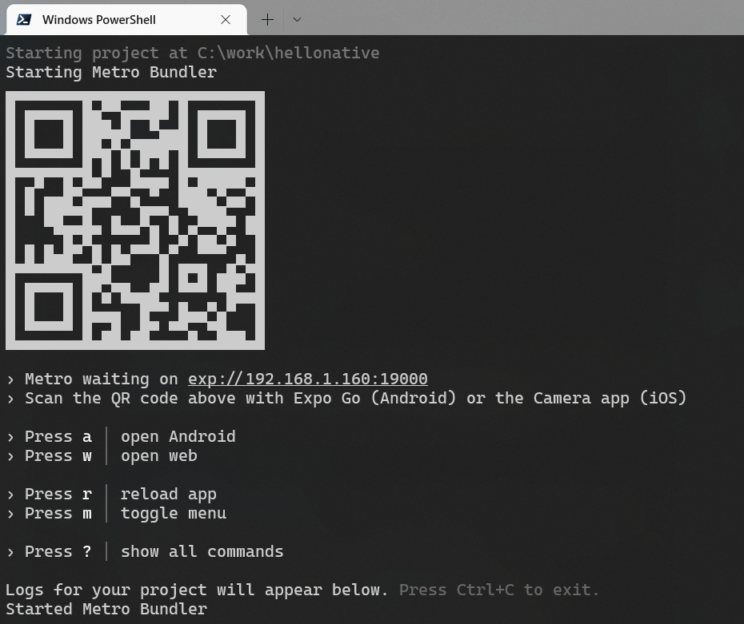
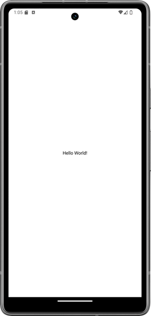

- Expo is a set of tools, libraries, and services for building React Native applications more easily and efficiently (https://expo.dev/).
- Node.js LTS release version is required

### Create your first app
- You can create a new React Native app using the following commands in terminal:
```bash
npx create-expo-app YOUR_APP_NAME
cd YOUR_APP_NAME
npx expo start
```

:::note 
Linux and macOS users have to install Watchman. See more from https://docs.expo.io/get-started/installation/
:::

- Expo opens Metro Bundler in your terminal after you run your app.
- Install EXPO app to your mobile device
- Android: Read the QR code with the EXPO app
- iOS: Read the QR code using the device camera
- You can also run your app in emulator or USB connected device.



- Open your expo project using the VSCode.
- Modify `return` statement in the **App.js** file.

```jsx
return (
  <View style={styles.container}>
    <Text>Hello World!</Text>
  </View>
);
```



:::note
If you can't get app loading to your device, you can use tunnel connection type. Start your app using the following command:

```bash
npx expo start --tunnel
```
:::