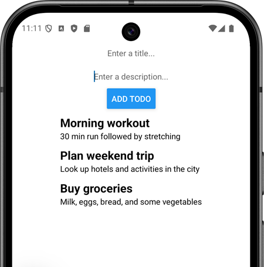

**`FlatList`** is a versatile list component with several useful features, including headers, footers, and scrolling capabilities.

In the next example, we create a simple todo app that looks the following:



#### Using the `FlatList` component:
Import the `FlatList` component from React Native:

```ts
import {
  StyleSheet,
  Text,
  View,
  Button,
  TextInput,
  FlatList,
} from "react-native";
```
First, we define a type for the todo items:
```ts
type TodoItem = {
  title: string,
  description: string
}
```
Declare new states to manage text input value and FlatList items:
```ts
// import useState
import { useState } from 'react';

// declare states
const [todo, setTodo] = useState<TodoItem>({ title: "" , description: "" });
const [todos, setTodos] = useState<TodoItem[]>([]);
```
Next, we render the `TextInput` and `Button` components:
```tsx
return (  
  <View style={styles.container}>
    <TextInput 
      value={todo.title}
      onChangeText={text => setTodo({...todo, title: text})}
      placeholder='Enter a title...'
    />
    <TextInput 
      value={todo.description}
      onChangeText={text => setTodo({...todo, description: text})}
      placeholder='Enter a description...'
    />
    <Button title='ADD TODO' onPress={handlePress}  />
  </View>
);
```
The `handlePress` function is called when the Add button is pressed. This function adds the current value of the `todo` state (representing the new task) to the `todos` state array. After adding the task to the array, the `todo` state is reset to an empty string, clearing the `TextInput` for the next task input.
```ts
const handlePress = () => {
  setTodos([...todos, todo]);
  setTodo({ title: "", description: "" });
};
```
Render the `FlatList` component to display all todos.
```tsx
<FlatList 
  data={todos} 
  renderItem={({ item }) => 
    <View>
      <Text>{item.title}</Text>
      <Text>{item.description}</Text>
    </View>
  } 
/>
```
The `renderItem` prop defines how data items are rendered within the list. The `data` prop indicates the source of the data, which must be an array. The `keyExtractor` prop extracts a unique key for each item in the list. It that is not defined, index will be used. The `renderItem` must return a single root element. To return multiple elements, wrap them in a container.

Next, we will add styling to the todo items in the list. We will display the title in a bigger font and bold. For that, we will create a new style:

```ts
const styles = StyleSheet.create({
  container: {
    paddingTop: 50,
    flex: 1,
    backgroundColor: '#fff',
    alignItems: 'center',
    justifyContent: 'center',
  },
  // highlight-start
  titleText: {
    fontSize: 20,
    fontWeight: 'bold',
  },
  // highlight-end
});
```
Then, we can use `titleText` style in the list item:
```ts
<FlatList
  style={{ marginTop: 10 }}
  data={todos} 
  renderItem={({ item }) => 
    <View>
      <Text style={styles.titleText}>{item.title}</Text>
      <Text>{item.description}</Text>
    </View>
  }
/>
```

There is also `FlashList` component (https://shopify.github.io/flash-list/) that is developed by Shopify. It is designed to handle large datasets efficiently. It is optimized for memory usage and it is suitable for applications that require smooth scrolling and rendering of large lists.

:::info[Task]
Read the `FlatList` documentation in https://reactnative.dev/docs/flatlist. 
- Add `ListEmptyComponent` to show text "No data" when the list is empty.
- Use `ItemSeparatorComponent` to render thin line between each list item. You can create a `View` with a height of 1 and a background color to render a line separator between items in a `FlatList`.
:::
