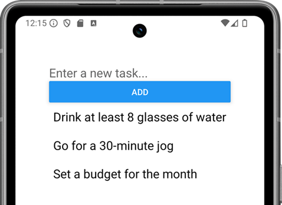

- **`FlatList`** is list component with some nice features (header, footer, scroll etc.)
- Import the `FlatList` component from React Native

```js
import {
  StyleSheet,
  Text,
  View,
  Button,
  TextInput,
  FlatList,
} from "react-native";
```

- Declare new states that are used for text input and `FlatList` items

```js
const [text, setText] = useState("");
const [data, setData] = useState([]);
```
- Render the `FlatList` component

```jsx
<FlatList data={data} renderItem={({item}) => <Text>{item.key}</Text>}
keyExtractor={(item, index) => index.toString()} />
```
- `renderItem` prop defines how data items are rendered
- `data` prop defines where data comes from. The value must be an array.
- `keyExtractor` prop extract a unique key for each item.

- Insert typed text from the `TextItem` component to the `data` state when button is pressed (Use spread syntax).

```js
const buttonPressed = () => {
  setData([...data, { key: text }]);
  setText("");
};
```


