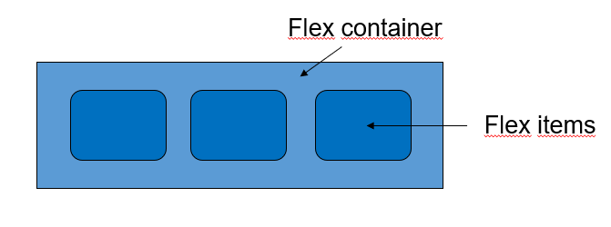
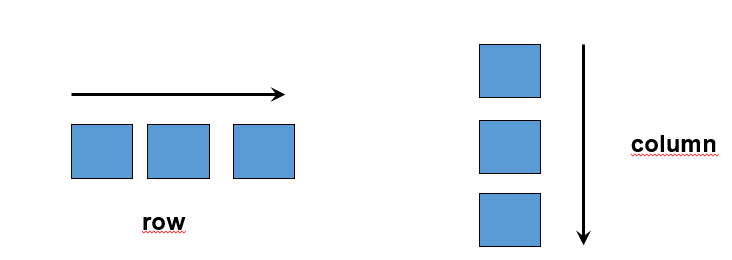
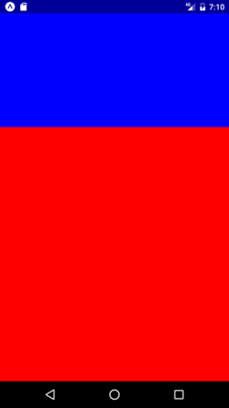
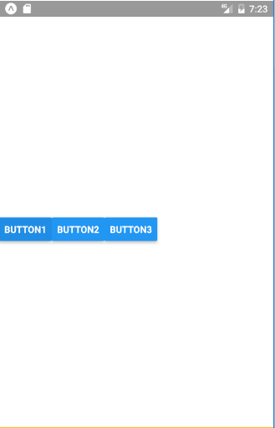
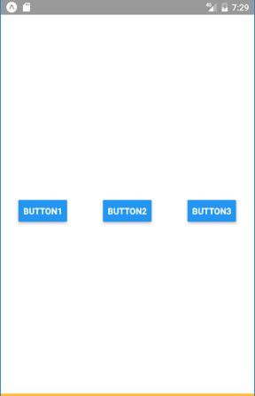

React Native uses **Flexbox** as its primary layout system. Flexbox works same way in React Native as it works with CSS in HTML. 

In the flexbox layout, the parent container becomes the **Flex container**, and all its children become **Flex items**.



### Common flexbox attributes

#### **`flexDirection`**

Defines the direction how components are organized inside the container (horizontally or vertically). Unlike web flexbox, the default direction in React Native is vertical.

The `flexDirection` also defines the **primary axis**

There are two primary values for `flexDirection`:
- `row`: This value sets the primary axis to be horizontal. Items are positioned from left to right along the row.
- `column`: This value sets the primary axis to be vertical. Items are positioned from top to bottom along the column.



#### **`flex`**
Defines how the space is divided between multiple flex containers or items.

```jsx
<View style={{flex: 1}}>
  <View style={{flex: 1}}> Some components goes here - 1/3 space </View>
  <View style={{flex: 2}}> Some components goes here - 2/3 space </View>
</View>
```


#### **`alignItems`**
Defines the alignment of childrens in the secondary axis. If `flexDirection` is `row` then the secondary axis is `column` and vice versa. 

Options include: `center`, `flex-start`, `flex-end`, `stretch`

```jsx
<View style={{flex: 1, flexDirection: 'row',
  alignItems: 'center'}}>
  <Button title="Button1" onPress={buttonPressed}/>
  <Button title="Button2" onPress={buttonPressed}/>
  <Button title="Button3" onPress={buttonPressed}/>
</View>
```




#### **`justifyContent`**
Defines the distribution of childrens in the **primary** axis. 

Options include: `center`, `flex-start`, `flex-end`, `space-around`, `space-between`

```jsx
<View style={{flex: 1, flexDirection: 'row',
  alignItems: 'center', justifyContent: 'space-around'}}>
  <Button title="Button1" onPress={buttonPressed}/>
  <Button title="Button2" onPress={buttonPressed}/>
  <Button title="Button3" onPress={buttonPressed}/>
</View>
```

