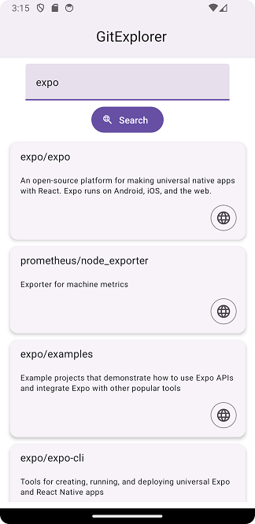

**React Native Paper** (https://reactnativepaper.com/) is a popular open-source UI library for React Native applications. It provides a set of customizable and pre-designed components that follow Google's Material Design.

### Installation
- Install React Native Paper UI library to your project by typing the following command in your project's folder.
```bash
npm install react-native-paper
```
- You also have to install `react-native-safe-area-context` to handle safe area. Safe areas are areas of the screen that are guaranteed not to be obstructed by system bars or notches on devices.
```bash
npm install react-native-safe-area-context
```
In the following example project, we will learn some of the components that library provides.

### Example Project

We create GitExplore app for searching GitHub repositories based on user-provided keywords. It is similar app that we already delveloped in the Networking section but now we build the user interface using React Native Paper components. The app also allows users to view repository details in a browser. 

Github REST API url to fetch repositories by keyword is https://api.github.com/search/repositories?q={keyword}.

The app looks the following:



#### Create a project

Create a new Expo project and install React Native Paper UI library and react-native-safe-area-context:

```bash
npx create-expo-app gitexplorer
cd gitexplorer
npm install react-native-paper
npm install react-native-safe-area-context
```
Let's first create a new component `GitExplorer`:

```jsx title="GitExplorer.js"
import { StyleSheet, View } from 'react-native';

export default function GitExplorer() {
  return (
    <View style={styles.container}>
    </View>
  );
}

const styles = StyleSheet.create({
  container: {
    flex: 1,
    marginTop: 10,
    backgroundColor: '#fff',
    alignItems: 'center',
    justifyContent: 'center',
  },
});
```
In the `App` component, we provide theme by using the `PaperProvider` component. The `PaperProvider` component ensures that all components have access to the necessary theme and configuration options. We also import `GitExplorer` component and render it in the `App` component. 

```jsx title="App.js"
import { PaperProvider } from 'react-native-paper';
import { StatusBar } from 'expo-status-bar';
import GitExplorer from './GitExplorer'

export default function App() {
  return (
    <PaperProvider>
      <GitExplorer />
      <StatusBar style="auto" />
    </PaperProvider>
  );
}
```
#### App header
Next, we will implement application app bar. Top app bars display navigation, actions, and text at the top of a screen. React Native Paper provides component `Appbar` that we will display in our `App` component. The `mode` prop defines the size height of the Appbar and `center-align` use the default height and center-align title text. 

```jsx title="App.js
import { PaperProvider } from 'react-native-paper';
import { StatusBar } from 'expo-status-bar';
// highlight-next-line
import { Appbar } from 'react-native-paper';
import GitExplorer from './GitExplorer'

export default function App() {
  return (
    <PaperProvider>
      // highlight-start
      <Appbar mode="center-aligned" elevated>
        <Appbar.Content title="GitExplorer" />
      </Appbar>
       // highlight-end
      <GitExplorer />
      <StatusBar style="auto" />
    </PaperProvider>
  );
}
```
Now, you should see the app bar at the top of you app.

#### Button & TextInput

In the `GitExplorer` component, we need two states to store keyword and repositories.

```jsx title="GitExplorer.js"
// highlight-next-line
import { useState } from 'react';
import { StyleSheet, View } from 'react-native';

export default function GitExplorer() {
  // highlight-start
  const [keyword, setKeyword] = useState('');
  const [repositories, setRepositories] = useState([]);
  // highlight-end

  return (
    <View style={styles.container}>
    </View>
  );
}

```

Then, we render `TextInput` component that allows user to input keyword that is used in the fetch request. The React Native Paper `TextInput` component have similar props than React Native component (such as value, onChange etc.). React Native Paper `TextInput` provides additional props for Material Design-specific features such as `label`. The `label` prop is used to provide a floating label for the input field.  

The React Native `Button` component renders a basic button with platform-specific styling. It has a simple appearance and is not highly customizable in terms of design. React Native Paper's `Button` component, on the other hand, follows Material Design guidelines and offers more styling options out of the box. In our app we are using contained button and that can be defined using the `mode` props. We also display web search icon in our button using the `icon` props. See the list of supported icons in https://callstack.github.io/react-native-paper/docs/guides/icons.

```jsx title="GitExplorer.js"
import { useState } from 'react';
// highlight-next-line
import { Button, TextInput } from 'react-native-paper';
import { StyleSheet, View } from 'react-native';

export default function GitExplorer() {
  const [keyword, setKeyword] = useState('');
  const [repositories, setRepositories] = useState([]);

  return (
    <View style={styles.container}>
      // highlight-start
      <TextInput
        style={{ width: '90%', marginBottom: 10 }} 
        label="Keyword"
        value={keyword}
        onChangeText={text => setKeyword(text)}
      />
      <Button mode="contained" icon="search-web">
        Search
      </Button>
      // highlight-end
    </View>
  );
}
```

In this phase, your app should look like the image below:


#### Fetch

Next, we implement the network request to fetch repositories. Add the following function in your `GitExplorer` component.

```js
const handleFetch = () => {
  fetch(`https://api.github.com/search/repositories?q=${keyword}`)
  .then(response => {
    if (!response)
      throw new Error("Error in fetch: " + response.statusText);

    return response.json();
  })
  .then(data => setRepositories(data.items))
  .catch(err => console.error(err))
}
```

The `handleFetch` function is executed when the button is pressed.

```jsx title="GitExplorer.js"
  return (
    <View style={styles.container}>
      <TextInput
        style={{ width: '90%', marginBottom: 10 }} 
        label="Keyword"
        value={keyword}
        onChangeText={text => setKeyword(text)}
      />
      // highlight-next-line
      <Button mode="contained" icon="search-web" onPress={handleFetch}>
        Search
      </Button>
    </View>
  );

```

#### Flatlist & Card

Then we display repositories using the React Native `FlatList` component. Now, each row displayed using React Native Paper `Card` component (https://callstack.github.io/react-native-paper/docs/components/Card/). To show text we use React Native Paper `Text` component that provides pre-defined text styles. You can see all styles in https://callstack.github.io/react-native-paper/docs/components/Text/.

```js title="GitExplore.js"
import { useState } from 'react';
import { Button, TextInput, Card, Text } from 'react-native-paper';
import { StyleSheet, View, FlatList } from 'react-native';

```
React Native `FlatList` is used to render a list of repositories. Each item in the list is represented by a `Card` component. This is a component from React Native Paper library representing a card UI element. It contains a title (repository full name) and a description (item.description). React Native Paper's `Text` component follows the typography guidelines specified in Material Design, which includes various styles like headline, title, subtitle, body, and caption. You can see all styles in https://callstack.github.io/react-native-paper/docs/components/Text/.

```jsx title="GitExplorer.js"
  return (
    <View style={styles.container}>
      <TextInput
        style={{ width: '90%', marginBottom: 10 }} 
        label="Keyword"
        value={keyword}
        onChangeText={text => setKeyword(text)}
      />
      <Button mode="contained" icon="search-web" onPress={handleFetch}>
        Search
      </Button>
      // highlight-start
      <FlatList 
        style={{ marginTop: 10, width: '90%'}}
        data={repositories}
        renderItem={({item}) => 
          <Card style={{ marginBottom: 10 }}>
            <Card.Title title={item.full_name} />
            <Card.Content>
              <Text variant="bodyMedium">{item.description}</Text>
            </Card.Content>        
          </Card>
        }
      />
      // highlight-end
    </View>
  );
```

#### Web browser

#### Activity indicator