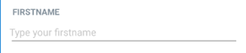

### Installation
- Install UI library to your project by typing the following command in your project folder.

```bash
npm install @rneui/themed @rneui/base
```
- Next, we will learn some of the components that library provides.

### Components

#### `Header` 
- Header of your app that can contain navigation components.


- Import the Header component
```js
import { Header } from '@rneui/themed';
```
- Render the `Header` component in your app. You can define components in the left, center and right sides of the header. The components can be `{text: string, …props}`, `{icon: string, …props}` or React component.
```jsx
<Header
  leftComponent={{ icon: 'menu', color: '#fff' }}
  centerComponent={{ text: 'SHOPPING LIST', style: { color: '#fff' } }}
  rightComponent={{ icon: 'home', color: '#fff' }}
/>
```

#### `Icon`

- Import the `Icon` component.
```js
import { Icon } from '@rneui/themed';
```
- Use the Icon component in your app.
```js
<Icon type="material" name="alarm" />
````


- The `type` prop defines the icon set. 
- See the icon sets that are available from https://reactnativeelements.com/docs/components/icon
- You can use `reverse` prop to get icon button.

```jsx
<Icon type="material" reverse color="lightblue" name="alarm" onPress={setAlarm} />
```


#### `Input`

- Import the `Input` component
```js
import { Input } from '@rneui/themed';
```
- Use component in your app (Note! `Input` inherits all props from React Native `TextInput` component)

```js
<Input 
  placeholder='Type your firstname' label='FIRSTNAME' 
  onChangeText={firstname => setFirstname(firstname)} value={firstname} />
```




#### `Button`

- Import the Button component
```js
import { Input, Button } from '@rneui/themed';
```
- Use the `Button` component in your app
```html
<Input placeholder='Type your firstname' label='FIRSTNAME' 
  onChangeText={firstname => setFirstname(firstname)} value={firstname}/>
<Button raised icon={{name: 'save'}} onPress={saveItem} title="SAVE" /> 
```


#### `ListItem`

- Import the `ListItem` component
```js
import { ListItem } from '@rneui/themed';
```
- Use the `ListItem` component in `FlatList` using your data (`ListItem` has child components like `ListItem.Content`, `ListItem.title`, `ListItem.Subtitle`, etc.).

```jsx
renderItem = ({ item }) => (
  <ListItem bottomDivider>
    <ListItem.Content>
      <ListItem.Title>{item.description}</ListItem.Title>
      <ListItem.Subtitle>{item.amount}</ListItem.Subtitle>
    </ListItem.Content>
  </ListItem>
)
```
---
- Render the list items in  React Native `FlatList` component.
```jsx
<FlatList
  data={data}
  renderItem={renderItem}
  keyExtractor={(item, index) => index.toString()}
/>
```
. The `ListItem` component has `onPress` and `onLongPress` event props, that you can use to define functions to invoke when an item is pressed.


